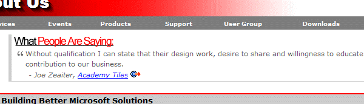

      Testimonials are a great way of making people comfortable with dealing with your
      company. They give the website a positive vibe and provide users with something
      relational that they will identify with (problems solved, needs met, people made
      happy, economic crisis avoided, etc.) 

      SSW have a random testimonials box up the top of many pages. One example is the
      <a href="http://www.ssw.com.au/ssw/Company/AboutUs.aspx">About Us</a> page.

 <excerpt class='endintro'></excerpt> 
<dl class="image"><dt>
      ​
       
   </dt><dd>Figure: Testimonials as displayed on SSW's About Us page</dd></dl>
 Another alternative is having the testimonials listed down the right hand side of the screen. An example of this can be seen at: 
   <a href="http://www.ssw.com.au/ssw/Redirect/Codesmith.htm">http://www.ericjsmith.net/codesmith/</a>. 

 An interesting spin on the previous link is a website that still has the testimonials down the right hand side of the page, however it displays exerts of these testimonials in comic book style speech bubbles. An example of this can be seen at: 
   <a href="http://www.ssw.com.au/ssw/Redirect/RichTextBox/RichTextBox.htm">http://www.richtextbox.com/richtextbox/</a>. 

