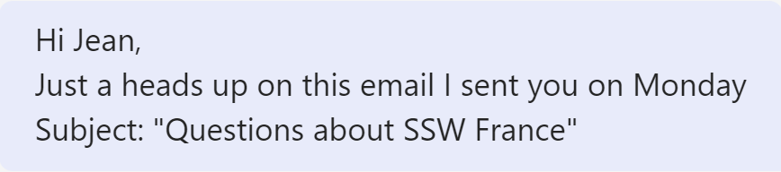

Usually, when mentioning an email in a Microsoft Teams chat, the approach is straightforward, such as typing "email subject: Good morning."

<!--endintro-->

An easy way to elevate this and make your messages more visually appealing is by utilizing text formatting: instead of the traditional format, you can employ the "> “ command, which conveniently transforms your text into an email subject format.
This formatting not only enhances the aesthetic appeal of your messages but also facilitates quick comprehension in the team conversation.

::: bad  
  
:::

::: good  
  
:::

Try it now! Open a Microsoft Teams chat and type in “> This is an email subject” and press enter.
