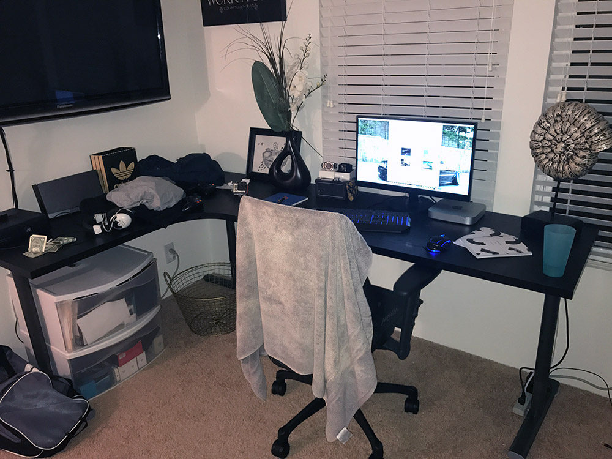

 The 5S desk space organization system was invented by the Japanese. Basically, it is a 5 step daily procedure to keep your desk clean and common stuff in the same place. When you have no useless stuff around, it brings you peace of mind and efficiency.  

 <excerpt class='endintro'></excerpt> 

Here are some resources on the topic:  
<ul><li> 
       <a href="https://goleansixsigma.com/apply-5s-home-office-desk/">How to Apply 5S : Home Office Desk</a> by Darion Mabe </li><li> 
      <a href="https://blogs.mtu.edu/improvement/2011/08/17/let%e2%80%99s-get-organized-how-to-5s-your-desk/">Let’s Get Organized! How to 5S your desk!</a> by wmdavis </li><li> 
      <a href="https://en.wikipedia.org/wiki/5S_%28methodology%29">5S (methodology) on Wikipedia</a> </li></ul>

<dl class="badImage"><dt>  </dt><dd>Bad example - A messy desk is a messy head </dd></dl>
Photo: courtesy of goleansixsigma.com (<a href="https://goleansixsigma.com/apply-5s-home-office-desk/">source</a>). 

​ <dl class="goodImage"><dt>  </dt><dd>Good example - A clean and productive workspace following the 5S methodology </dd></dl>
Photo: courtesy of goleansixsigma.com (<a href="https://goleansixsigma.com/apply-5s-home-office-desk/">source</a>). 

