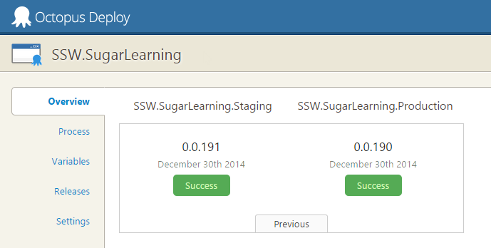
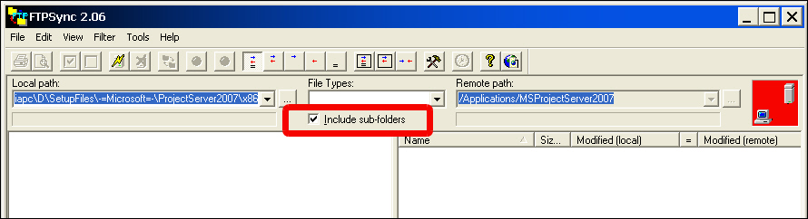

Often, deployment is either done manually or as part of the build process. But deployment is a completely different step in your lifecycle. It's important that deployment is automated, but done separately from the build process.

<!--endintro-->

There are two main reasons you should separate your deployment from your build process:

1. You're not dependent on your servers for your build to succeed. Similarly, if you need to change deployment locations, or add or remove servers, you don't have to edit your build definition and risk breaking your build.
2. You want to make sure you're deploying the  **\*same\*** (tested) build of your software to each environment. If your deployment step is part of your build step, you may be rebuilding each time you deploy to a new environment.

The best tool for deployments is [Octopus Deploy](https://octopus.com/).
<dl class="image">&lt;dt&gt;  &lt;/dt&gt;<dd> Figure: Good Example - SSW uses Octopus Deploy to deploy Sugar Learning</dd></dl>
Octopus Deploy allows you to package your projects in Nuget packages, publish them to the Octopus server, and deploy the package to your configured environments. Advanced users can also perform other tasks as part of a deployment like running integration and smoke tests, or notifying third-party services of a successful deployment.

[Version 2.6 of Octopus Deploy](https://octopus.com/blog/2.6) introduced the ability to create a new release and trigger a deployment when a new package is pushed to the Octopus server. Combined with Octopack, this makes continuous integration very easy from Team Foundation Server.

### What if you need to sync files manually?

Then you should use an FTP client, which allows you to update files you have changed.  **FTP Sync** and  **Beyond Compare** are recommended as they compare all the files on the web server to a directory on a local machine, including date updated, file size and report which file is newer and what files will be overridden by uploading or downloading. you should only make changes on the local machine, so we can always upload files from the local machine to the web server.

This process allows you to keep a local copy of your live website on your machine - a great backup as a side effect.

Whenever you make changes on the website, as soon as they are approved they will be uploaded. You should tick the box that says "sync sub-folders", but when you click sync be careful to check any files that may be marked for a reverse sync. You should reverse the direction on these files. For most general editing tasks, changes should be uploaded as soon as they are done. Don't leave it until the end of the day. You won't be able to remember what pages you've changed. And when you upload a file, you should sync EVERY file in that directory. It's highly likely that un-synced files have been changed by someone, and forgotten to be uploaded. And make sure that deleted folders in the local server are deleted in the  remote server.
<dl class="image">&lt;dt&gt;  &lt;/dt&gt;</dl>
If you are working on some files that you do not want to sync then put a  **\_DoNotSyncFilesInThisFolder\_XX.txt** file in the folder. (Replace XX with your initials.) So if you see files that are to be synced (and you don't see this file) then find out who did it and tell them to sync. The reason you have this TXT file is so that people don't keep telling the web

**NOTE:** Immediately before deployment of an ASP.NET application with FTP Sync, you should ensure that the application compiles - otherwise it will not work correctly on the destination server (even though it still works on the development server).
