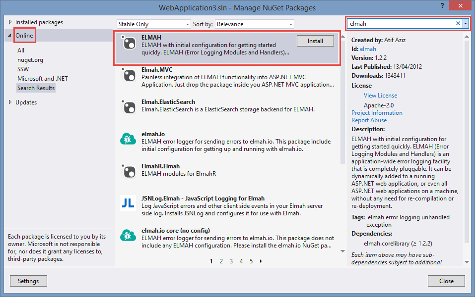

When developing software, exceptions are a fact-of-life you will need to deal with. Don't reinvent the wheel, use an existing exception handling library or service.

The best exception handling service is [Application Insights for Visual Studio Online](/rules-to-better-application-insights), but if you can't use that, then use [elmah.io](https://elmah.io/).

Your users should never see the “yellow screen of death” in ASP.NET, or the “unhandled exception” message in a Windows application. Errors should always be caught and logged – preferably in a SQL database.

<!--endintro-->

At SSW we use Application Insights for Visual Studio Online.

::: greybox
**Application Insights** will tell you if your application goes down or runs slowly under load. If there are any uncaught exceptions, you’ll be able to drill into the code to pinpoint the problem. You can also find out what your users are doing with the application so that you can tune it to their needs in each development cycle.
:::

If Application Insights for Visual Studio Online is not available we use ELMAH when developing web applications. From its [NuGet page](https://www.nuget.org/packages/ELMAH):

::: greybox
**elmah.io** with initial configuration for getting started quickly. ELMAH (Error Logging Modules and Handlers) is an application-wide error logging facility that is completely pluggable. It can be dynamically added to a running ASP.NET web application, or even all ASP.NET web applications on a machine, without any need for re-compilation or re-deployment.
:::

If you are still developing Windows applications, then SSW Exception Logger is the one to use. Read [SSW .NET Toolkit – LadyLog User Guide](https://www.ssw.com.au/ssw/NetToolKit/04ExceptionReporter.aspx).

ELMAH can be easily added to your application from NuGet, and it configures itself.

