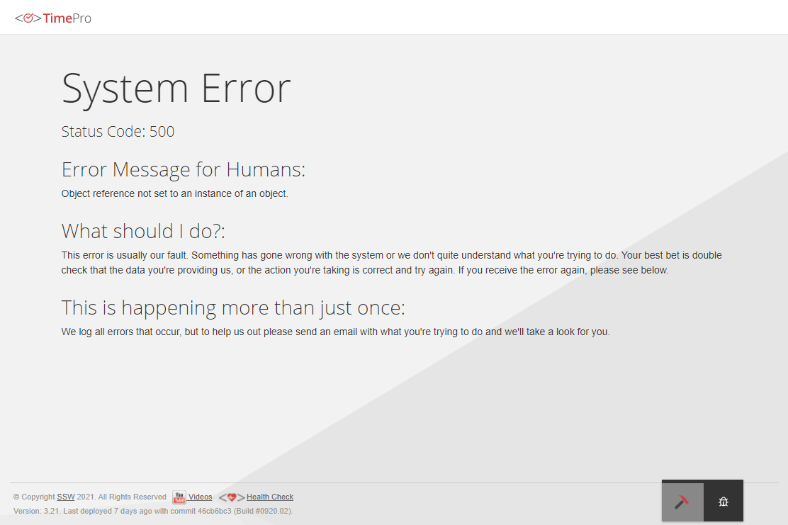
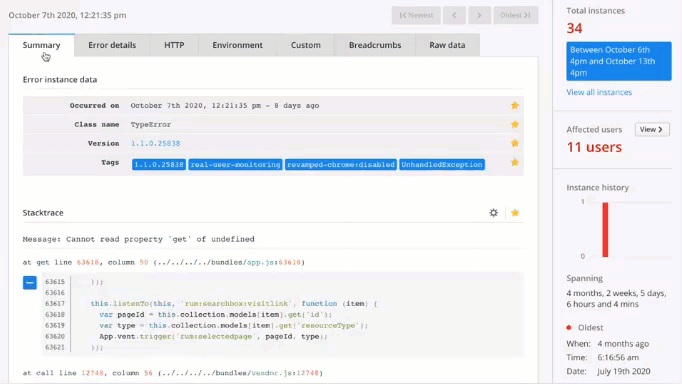

When developing software, exceptions are a fact-of-life you will need to deal with. Don't reinvent the wheel, use an existing exception handling library or service.

The best exception handling libraries are:

<!--endintro-->

* Application Insights (recommended)
* Seq
* RayGun

Your users should never see the “yellow screen of death” in ASP.NET, or the “unhandled exception” message in a Windows application. Errors should always be caught and logged – there are plenty of great services that help you fall into the pit of success. They show you great dashboards, integrate with your preferred communication tools, allow you to get great telemetry, and help you drill down to the root cause. As developers you should be alerted when something is going wrong and be able to see details to help you track down and fix bugs before clients notice them and call up asking you to fix it. With exception libraries, you should already be on it.

::: bad

:::

::: good

:::

## Application Insights

[**Application Insights**](/rules-to-better-application-insights) is recommended whenever possible. If you are still developing Windows applications, then you can still use Application Insights, read [here](https://docs.microsoft.com/en-us/azure/azure-monitor/app/windows-desktop) for more details.

**Application Insights** will tell you if your application goes down or runs slowly under load. If there are any uncaught exceptions, you’ll be able to drill into the code to pinpoint the problem. You can also find out what your users are doing with the application so that you can tune it to their needs in each development cycle.

Application Insights gives you very useful graphs and analysis which give you a good overview of how things are going. See [here](/rules/rules-to-better-application-insights) for more details.

::: good

:::

If Application Insights is not available, we use [**Seq**](https://datalust.co/seq) when developing web applications. Seq is great for identifying specific issues and how to fix them, but is not as good as Application Insights at letting you see the big picture.

## Seq

**Seq** is built for modern structured logging with message templates. Rather than waste time and effort trying to extract data from plain-text logs with fragile log parsing, the properties associated with each log event are captured and sent to Seq in a clean JSON format. Message templates are supported natively by ASP.NET Core, Serilog, NLog, and many other libraries, so your application can use the best available diagnostic logging for your platform.

::: good

:::

## RayGun

[Raygun](https://raygun.com) is another great tool as it helps you identify and monitor errors in Single Page Applications.

::: good

:::
