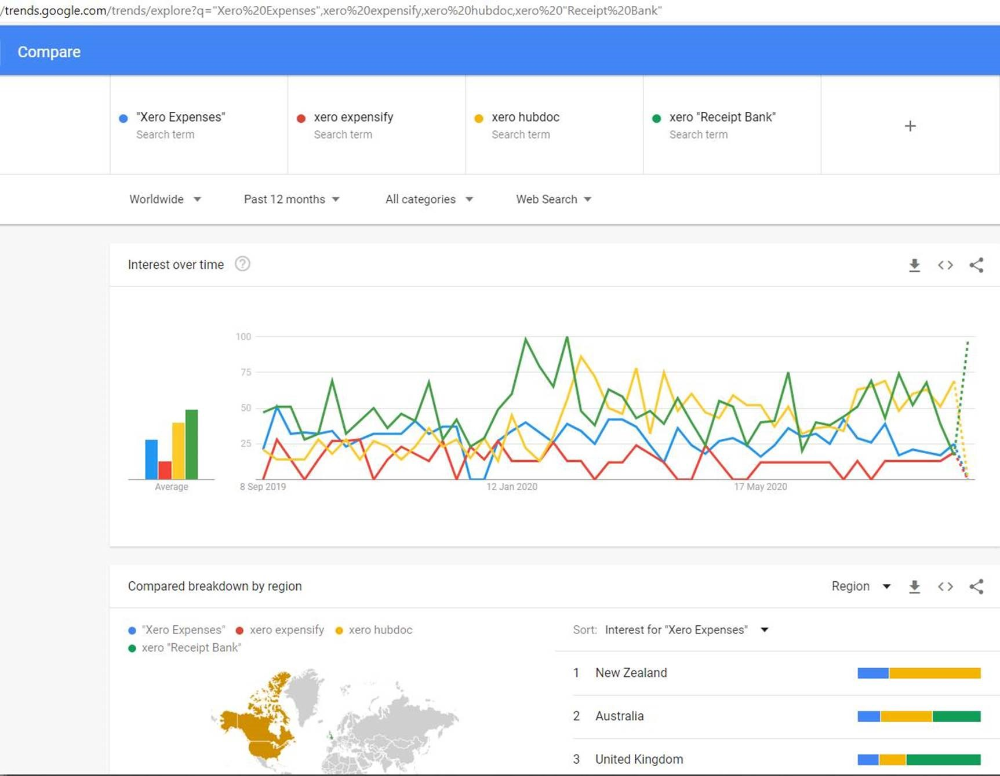
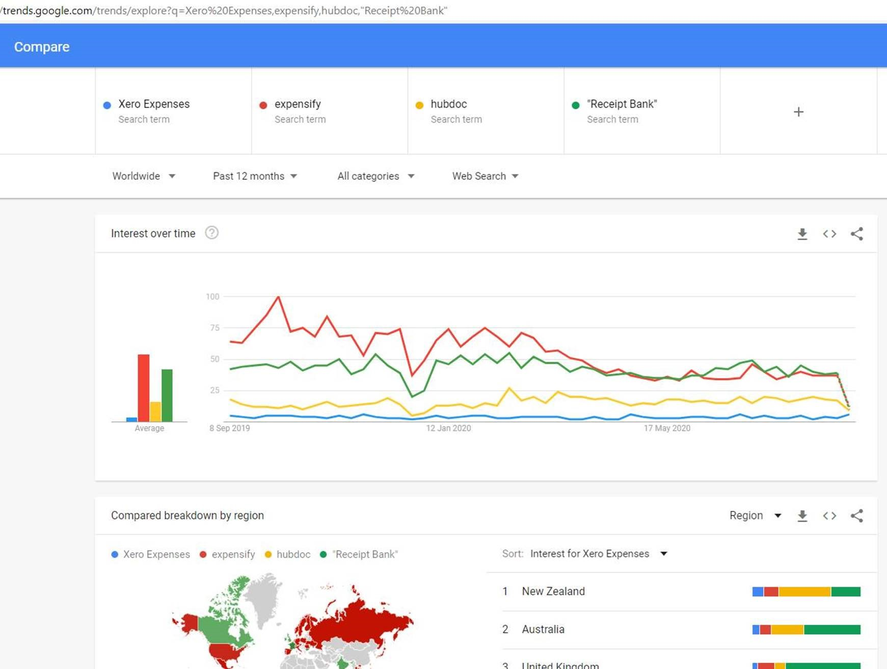

Tracking expenses can be a painful process of accumulating receipts and entering them into outdated systems… but there is a better way.   

Various apps help solve the above problem. Using a modern Accounting system such as Xero, some connected apps can be used in conjunction with the accounting system and they include:

* [Xero Me](https://apps.apple.com/au/app/xero-me/id991901494)
* [Expensify](https://www.expensify.com/)
* [Hubdoc](https://www.hubdoc.com/)

It may be difficult to determine which app would be best suited for your business so below is a comparison of some of the major features of each app.

<!--endintro-->

There are 2 purposes when evaluating an Expense app:

**\#1 Reimbursements** – when you are at the shop and you pay for something personally and want the app to take a photo and send it to the office and later see the $ come back into your account.
**\#2 General expenses** – when you are at the shop and using the company credit card, you don’t need reimbursement, but you do need to give accounts a photo of the receipt and the purchased item.

| Product                        | **Xero Me**                                                                                                                                       | **Expensify**                                                    | **Hubdoc**                                                                                                                 |
| ------------------------------ | ------------------------------------------------------------------------------------------------------------------------------------------------- | ---------------------------------------------------------------- | -------------------------------------------------------------------------------------------------------------------------- |
| Pricing                        | $5 per active user/mo                                                                                                                             | $840/year (minimum)                                              | **Free with Xero✔**                                                                                                        |
| Submission Procedure           | **Phone App – take a photo and submit it through the app ✔**                                                                                      | **Same as Xero Me ✔**                                            | **Same as Xero Me ✔**                                                                                                      |
| Restriction on Invoice uploads | **Unlimited ✔**                                                                                                                                   | **Unlimited ✔**                                                  | **Unlimited ✔**                                                                                                            |
| Back-up                        | **Unlimited - use cloud back up and security. Never deletes ✔**                                                                                   | **Unlimited – Never deletes and remains archived ✔**             | **Unlimited – use cloud back up and security. Never deletes ✔**                                                            |
| Organizing                     | **Organised on user-submitted, expense type or date order ✔**                                                                                     | Can be manually organized into folders or reports                | Requires greater security privileges than uploader only. Automatically organized into folders (can be updated).            |
| Expense Rules                  | Automate rules (or after the first occurrence) as to where expenses are to be accounted to (account categories)                                   | **Same as Xero Me – little easier to navigate to the section ✔** | Same as Xero Me – however seems to only be on each invoice (can’t create outside of existing invoice – not that important) |
| Accounting Codes               | **Syncs with Xero account categories and automatically chooses those options. Brings bank reconciliations of these invoices to 90% of the way ✔** | Only available on the subscription plan of $1800/year            | **Same as Xero Me✔**                                                                                                       |
| Phone Compatibility            | **All Phones ✔**                                                                                                                                  | **All Phones ✔**                                                 | **All Phones ✔**                                                                                                           |
| Two-factor Authentication      | **Yes ✔**                                                                                                                                         | No                                                               | **Yes ✔**                                                                                                                  |
| How-to Videos                  | Yes                                                                                                                                               | **Yes - The most videos ✔**                                      | Yes                                                                                                                        |
| Descriptive Notes              | **Yes ✔**                                                                                                                                         | **Yes ✔**                                                        | Not available                                                                                                              |
| Bank Specification             | **Yes ✔**                                                                                                                                         | Not at $840/year                                                 | **Yes ✔**                                                                                                                  |

**Overall, the winner is Xero Me.** The design of the Xero Me app provides all the user experience to enable simple and convenient reimbursement requests or company spent money receipts for reconciliation. 

The best feature of Xero Me reimbursement is that the employee's bank details are automatically assigned when they submit a claim. The approver (Accountant or Business Owner), approves of the expense, it will be generated as a payable invoice in the 'Bills' section of Xero and dealt with like any other bill.

Although Expensify is capable of performing this function, it is expensive.

Expense apps are a timesaver, both for the day to day user, as well as the accountant receiving the expenses.

As a user, all you have to do is take a photo of the receipt from your mobile app, file or add any comments (all other data is pulled in via OCR “Smart-scan”), then all of these expenses get batched together and sent on a weekly basis to the accountant, who can then manage them in bulk.

As an added bonus in Xero Me, employees can also see their leave entitlements and payslips.

### **What are the most popular expenses apps?**

**With Xero:** 

More at **[Google Trends](https://trends.google.com/trends/explore?q=%22Xero%20Expenses%22%2cxero%20expensify%2cxero%20hubdoc%2cxero%20%22Receipt%20Bank%22)**

**Without Xero:**

More at **[Google Trends](https://trends.google.com/trends/explore?geo=US&q=Xero%20Expenses%2cexpensify%2chubdoc%2c%22Receipt%20Bank%22)**