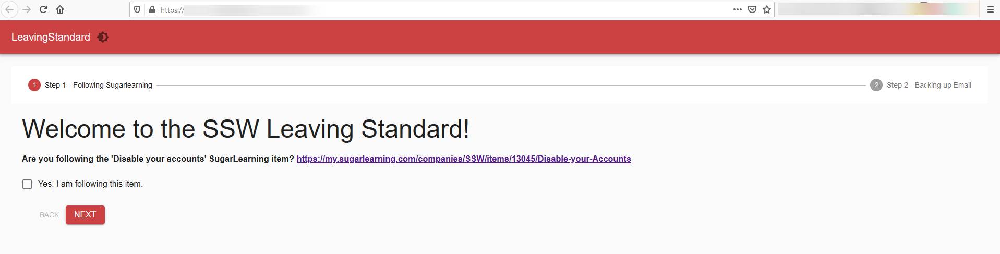

PowerShell Universal is a platform to make websites, dashboards, and scripts using only PowerShell commands, without the need to have any web development knowledge, perfect for your SysAdmins. 

<a href="https://ironmansoftware.com/powershell-universal/">PowerShell Universal</a> is a platform built by Ironman Software that allows you to:
<ol><li>Create webpages and dashboards with PowerShell commands;</li><li>Orchestrate PowerShell script execution, together with auditing;</li><li>Use its API to communicate with the scripts and dashboards.​</li></ol>
 <excerpt class='endintro'></excerpt> 

​For example, SSW uses PowerShell Universal Dashboards to automate repeating SysAdmin tasks and create a nice user interface to run them:​ 
<dl class="goodImage"><dt></dt><dd>Figure: Good Example - Dashboard to automate employee's leaving standard </dd></dl>
Running commands directly in the PowerShell CLI without data, schedule or a nice UI is a thing of the past, and you should be using the capabilities of PowerShell Universal to keep your scripts well maintained.
<dl class="badImage"><dt></dt><dd>Figure: Bad Example - Running commands by hand directly</dd></dl>
You can read its full documentation at <a href="https://docs.ironmansoftware.com/">https://docs.ironmansoftware.com</a>. 

