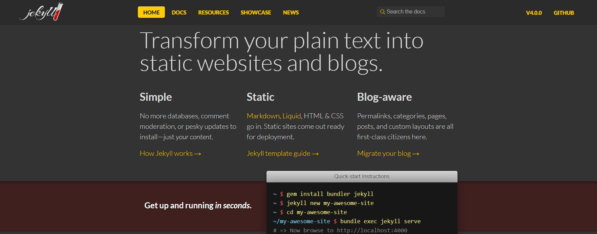
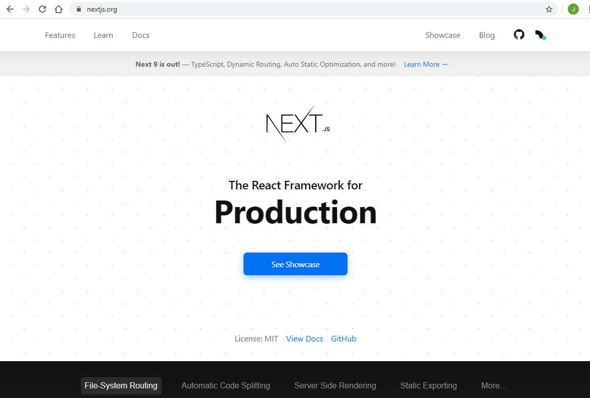
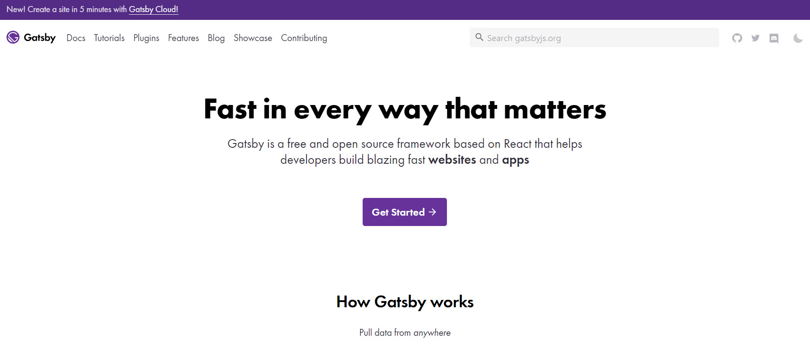

The best static hosting method is [Azure static web apps](https://azure.microsoft.com/en-us/services/app-service/static/). It is cheap and easy to use.

The best static site generator is Gatsby. Gatsby is great because it's a simple and yet powerful way to build static React applications. It works natively with GitHub as a Datasource and you can query via GraphQL based on Tags and Branches.

::: bad

:::

::: bad

:::

::: good

:::

Two examples of the static site tech stack in action are [SSW People](https://www.ssw.com.au/people/) and [SSW Rules](https://www.ssw.com.au/rules/)
