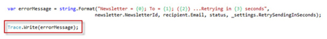
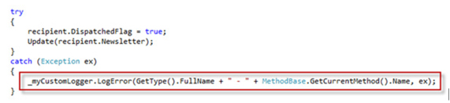
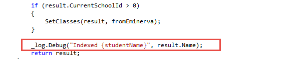
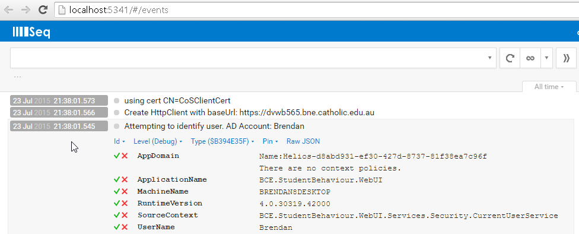

Did you know that writing your own logging infrastructure code wastes time? You should use a logging library, and the best logging library is Serilog.

Serilog is a NuGet package that can be included in any .NET application, is easy to configure, supports many different output targets, has great performance, and allows for runtime changes to the configuration. Serilog also supports full integration with log4net so is easy to use with any older codebase using log4net.

 <excerpt class='endintro'></excerpt> 

Serilog supports all the log4net concepts of logging at different levels of importance (e.g. Error, Warning, Information) and having different logs for different components of your application (e.g. a Customer Log and an Order Log).

Serilog's main advantage over previous loggers is its ability to serialize and log full .net objects rather than just strings. Serilog also has a powerful, nested context system allowing log events to be grouped by request, operation etc.  

Serilog has the concept of "sinks": pluggable modules that can consume, store and/or act on logging events. The most powerful sink is Seq - a web application that allows the user to perform complex search queries on incoming log data in real time.

Other sinks allow you to:
<ul class="p1"><li>save logs to a file </li><li>export to log4net (and subsequently use any log4net appender)</li><li>save to a database</li><li>export to Application Insights, New Relic, and many other APM platforms </li></ul>
Many other sinks are available as described here: <a href="https://github.com/serilog/serilog/wiki/Provided-Sinks">https://github.com/serilog/serilog/wiki/Provided-Sinks </a>
<dl class="badImage"><dt>  </dt><dd>Figure: Bad Example - Using Debug or Trace for logging, or writing hard coded mechanisms for logging does not allow you to configure logging at runtime</dd></dl><dl class="badImage"><dt>  </dt><dd>Figure: Bad Example - Roll your own logging components lack functionality, and have not been tested as thoroughly for quality or performance as log4net</dd></dl><dl class="goodImage"><dt>  </dt><dd>Figure: Good Example - Using serilog allows persisting structured log data to multiple stores, querying that data intelligently and requires less work to install and configure than a roll-you-own logger, and provides many more features</dd></dl> <dl class="goodImage"> <dt>  </dt><dd>Figure: Good Example - Seq provides a powerful UI for searching and viewing your structured logs</dd></dl>
Serilog should be added to your project via the NuGet package manager. 

See also <a href=/do-you-use-the-best-middle-tier-net-libraries>Do you use the best middle tier .NET libraries?</a>

