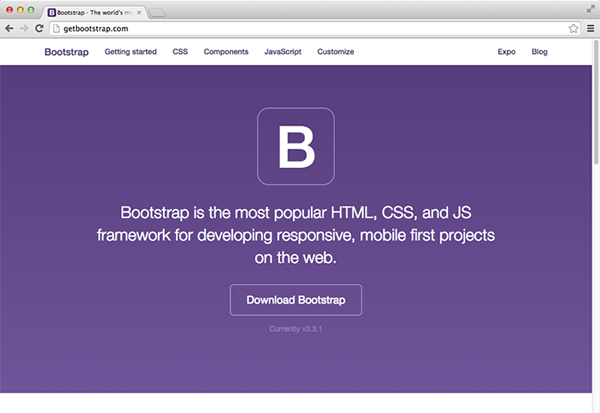

Don't waste time evaluating which Web UI libraries to use. Most of the commonly used libraries are very similar in functionality. The recommended library is [Bootstrap](https://getbootstrap.com/).

<!--endintro-->

It's the most popular available framework today, which means more people involved in the project, more tutorials and articles from the community, more real-world examples/websites, more third-party extensions, and better integration with other web development products

  

### The 3 things a developer need to know to get up and running quickly with ASP.NET MVC

`youtube: https://www.youtube.com/embed/z3bIM72-YaU?rel=0`
 
### Bootstrap & ASP.NET MVC - Intro / Quickstart

`youtube: https://www.youtube.com/embed/bIGiUSMBwoo?rel=0`
 
### Other useful frameworks

Now that you saved a lot of UI development time by using Bootstrap, you can play around with other useful frameworks.

* **[KendoUI](http://www.kendoui.com/)** for enhanced HTML and jQuery controls
* **[SignalR](http://signalr.net/)** for real-time web functionality
