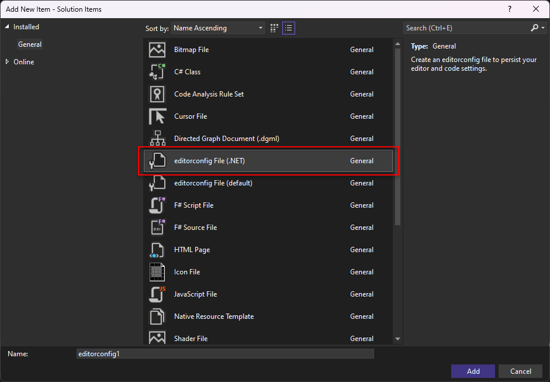
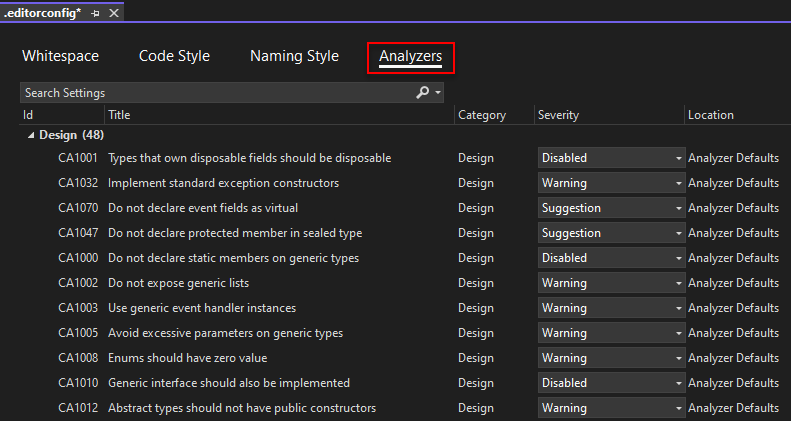

The code quality standard should extend the Visual Studio Analyzer. A wide variety of additional analyzers can be included via Nuget, the minimum standard should include Roslyn Security Guard.

<!--endintro-->

### Related Steps to Code Health:

* [Do you use the Code Health Extensions in VS Code?](/do-you-use-the-code-health-extensions-in-vs-code)
* [Do you run the Code Health checks in your VisualStudio.com Continuous Integration Build?](/do-you-run-the-code-health-checks-in-your-visualstudio-com-continuous-integration-build)

### Which Packages to Install in Visual Studio

Search & Install the NuGet packages:

* "Roslyn Security Guard" ([Nuget page for Roslyn Security Guard](https://www.nuget.org/packages/RoslynSecurityGuard/)) - Security audit on .NET Applications.
* (Optional) "StyleCop.Analysers" ([Nuget page for StyleCop.Analysers](https://www.nuget.org/packages/StyleCop.Analyzers/1.0.0)) - Ensures C# code style conformity. It is not compatible with Visual Studio 2022

Issues from these will now be returned in the Visual Studio analyser error list.

Your goal should be to get the issues in a solution down to zero.

If you believe the issues being raised are not important, please check the section below which outlines how to change the ruleset.

### Modify Visual Studio Analysis Ruleset

The goal is to develop a shared ruleset across projects. (Currently this is just the default settings). This will ensure the same standard and quality of code is maintained across all of the company's projects.
Any project specific rules should be documented in "_Instructions-CodeHealth.docx" which is to be kept in the solution.
Please also copy the current version number of this rule into the "_Instructions-CodeHealth.docx" in order to track what version your existing solution adheres to.

Starting in Visual Studio 2019, you can configure the severity of analyzer rules in an EditorConfig file.

EditorConfig file can belong to the Solution for the Solution-wide rules and to the Project for the Project-specific rules.

If you do not have the EditorConfig file yet, right click on either the project or solution node and go to Add | New Item. Next, select "editorconfig File (.Net)" and click Add.

To edit the ruleset, open your .editorconfig file.

In the Analyzers tab you can change the severity of the rules, for example disable the warning or convert it into an error.

