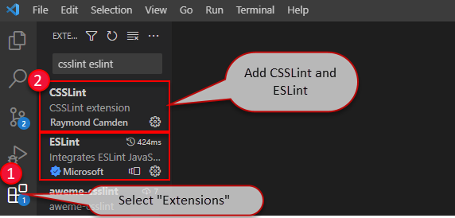

For lightweight web projects such as Angular, often VS Code is more appropriate than Visual Studio. So make sure your code quality remains consistent with CSSLint and ESLint.

<!--endintro-->

### Related Steps to Code Health:

* [Do you use the Code Health Extensions in Visual Studio?](/do-you-use-the-code-health-extensions-in-visual-studio)
* [Do you run the Code Health checks in your VisualStudio.com Continuous Integration Build?](/do-you-run-the-code-health-checks-in-your-visualstudio-com-continuous-integration-build)

### Which Extensions to Use in VS Code

For web projects, we advocate the use of CSSLint for css files and ESLint for typescript files. ([Why you should be using TypeScript instead of JavaScript](/do-you-know-when-to-use-typescript-vs-javascript-and-coffeescript))
Linters for these can be easily added to VS Code via extensions.
Simply select the "Extensions" tab, search for "CSSLint" and "ESLint" and click "Install" on each respectively.

If you prefer not to use the Extensions, you can install them using npm as normal. 
CSSLint ([CSSLint npm guide](https://www.npmjs.com/package/csslint))
ESLint ([ESLint npm guide](https://www.npmjs.com/package/eslint))