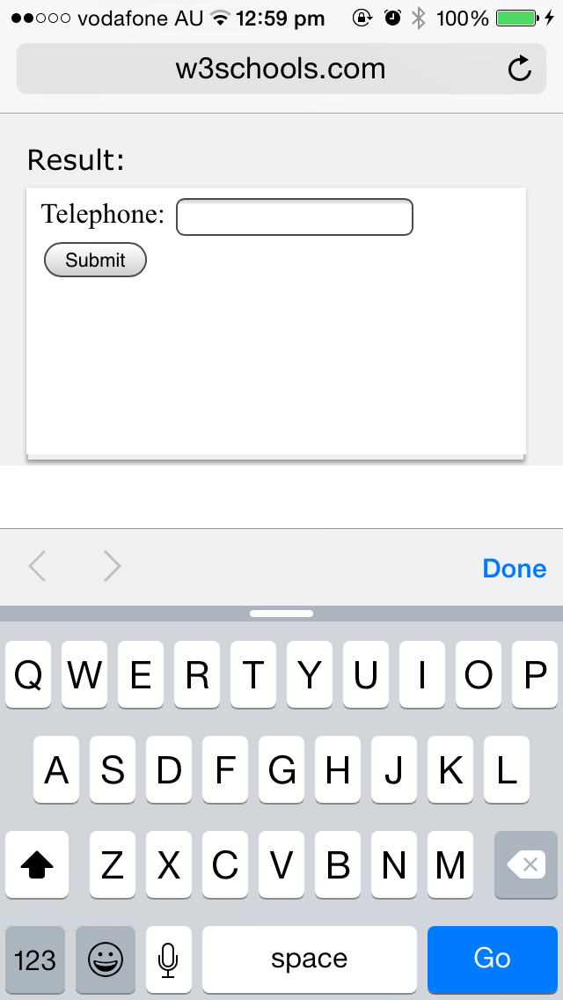
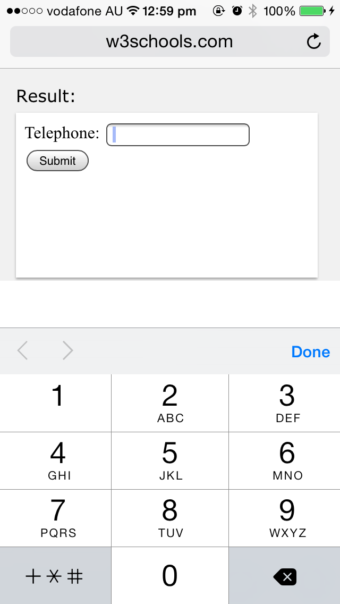

HTML5 introduced a whole slew of new type properties for forms. Gone are the days of just using type="text" for every field in a form (barring buttons and checkboxes).

Although most of these don't do anything on desktop, on mobile devices they bring up the correct keyboard. As we move into a more mobile digital age, small things like the proper numerical keyboard or a keyboard with a quick ".com" becomes increasingly important.

 <excerpt class='endintro'></excerpt> 
<dl class="ssw15-rteElement-ImageArea"><dt>
 
         
      

<label for="phone">Phone</label>: <input 
         type="text" name="phone"></input>
</dt><dd class="ssw15-rteElement-FigureBad">Figure: Bad Example – This field is using a text type and shows a standard keyboard on mobile</dd></dl>
 
<dl class="ssw15-rteElement-ImageArea"><dt>
 
      
      

      
<label for="phone">Phone</label>: <input 
         type="tel" name="phone"></input>
</dt><dd class="ssw15-rteElement-FigureGood">Figure: Good Example – This field is using the correct field type and shows the keypad on mobile</dd></dl>

    

Here is a table of some useful input types and what they do:
<table width="670" height="320" class="ssw15-rteTable-default"><tbody><tr class="ssw15-rteTableHeaderRow-default"><th class="ssw15-rteTableHeaderEvenCol-default">Type</th><th class="ssw15-rteTableHeaderOddCol-default">What</th></tr><tr class="ssw15-rteTableOddRow-default"><td class="ssw15-rteTableEvenCol-default">Color</td><td class="ssw15-rteTableOddCol-default">This is a color picker. This is not supported on mobile or in all browsers.</td></tr><tr class="ssw15-rteTableEvenRow-default"><td class="ssw15-rteTableEvenCol-default">Date</td><td class="ssw15-rteTableOddCol-default">This brings up the date picker on mobile</td></tr><tr class="ssw15-rteTableOddRow-default"><td class="ssw15-rteTableEvenCol-default">Datetime-local</td><td class="ssw15-rteTableOddCol-default">This brings up a date-time picker on mobile</td></tr><tr class="ssw15-rteTableEvenRow-default"><td class="ssw15-rteTableEvenCol-default">Email</td><td class="ssw15-rteTableOddCol-default">This adds ".com" and "@" to the keyboard on mobile</td></tr><tr class="ssw15-rteTableOddRow-default"><td class="ssw15-rteTableEvenCol-default">File</td><td class="ssw15-rteTableOddCol-default">Use then when you want a button to upload files. This will also allow users to upload from their mobile device’s photo library.</td></tr><tr class="ssw15-rteTableEvenRow-default"><td class="ssw15-rteTableEvenCol-default">Month</td><td class="ssw15-rteTableOddCol-default">This brings up a month and year picker on mobile</td></tr><tr class="ssw15-rteTableOddRow-default"><td class="ssw15-rteTableEvenCol-default">Number</td><td class="ssw15-rteTableOddCol-default">This displays as a number selector on desktop and can be set with upper and lower limits. However, it does not work on mobile yet.</td></tr><tr class="ssw15-rteTableEvenRow-default"><td class="ssw15-rteTableEvenCol-default">Password</td><td class="ssw15-rteTableOddCol-default">This masks the characters and should be used for any privacy sensitive information</td></tr><tr class="ssw15-rteTableOddRow-default"><td class="ssw15-rteTableEvenCol-default">Range</td><td class="ssw15-rteTableOddCol-default">This will show a slider control and works on mobile</td></tr><tr class="ssw15-rteTableEvenRow-default"><td class="ssw15-rteTableEvenCol-default">Search</td><td class="ssw15-rteTableOddCol-default">This should be used to define search fields</td></tr><tr class="ssw15-rteTableOddRow-default"><td class="ssw15-rteTableEvenCol-default">Tel</td><td class="ssw15-rteTableOddCol-default">This brings up the number pad on mobile</td></tr><tr class="ssw15-rteTableEvenRow-default"><td class="ssw15-rteTableEvenCol-default">Time</td><td class="ssw15-rteTableOddCol-default">This brings up the time picker on mobile</td></tr><tr class="ssw15-rteTableOddRow-default"><td class="ssw15-rteTableEvenCol-default">URL</td><td class="ssw15-rteTableOddCol-default">This adds ".com" to the keyboard on mobile</td></tr></tbody></table>

