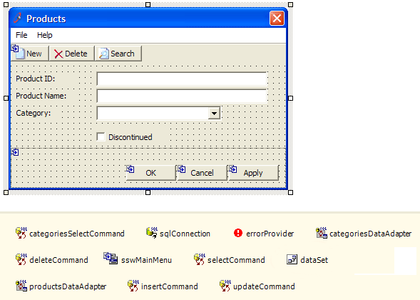
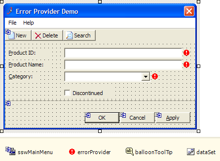

The designer should be used for all GUI design. Controls will be dragged and dropped onto the form and all properties should be set in the designer, e.g.

* Labels, TextBoxes and other visual elements
* ErrorProviders
* DataSets (to allow data binding in the designer)

<!--endintro-->

Things that do not belong in the designer:

* Connections
* Commands
* DataAdapters

However, and  **DataAdapter** objects should not be dragged onto forms, as they belong in the business tier. Strongly typed  **DataSet** objects should be in the designer as they are simply passed to the business layer. Avoid writing code for properties that can be set in the designer.

