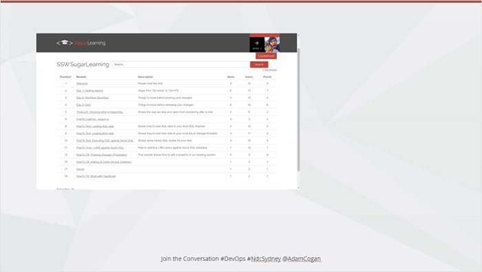
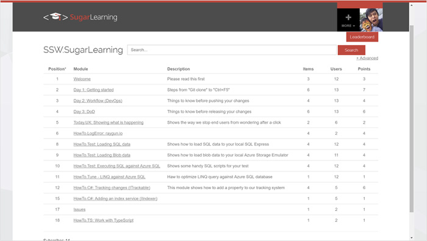

Small images are hard to see. Remember your audience sitting at the back of the room. Especially for screenshots displaying important text, use all your real estate.  

<!--endintro-->
<dl class="badImage">&lt;dt&gt;
       
   &lt;/dt&gt;<dd>Figure: Bad example - the image doesn't cover the whole slide</dd></dl><dl class="goodImage">&lt;dt&gt;
       
   &lt;/dt&gt; 
   <dd>Figure: Good example - Cover the whole slide with your image to make it easier for people to see from the back row</dd></dl>
