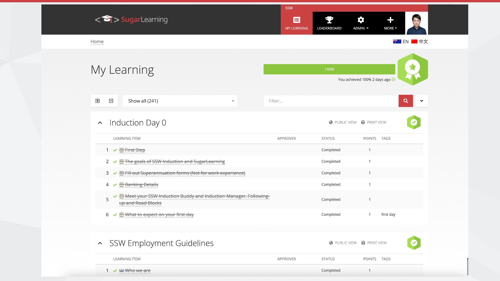

Small images are hard to see. Remember your audience sitting at the back of the room. Especially for screenshots displaying important text, use all your real estate.

<!--endintro-->

::: bad

:::

::: good

:::
