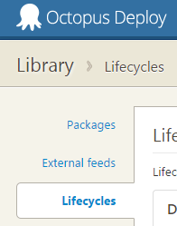
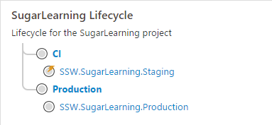
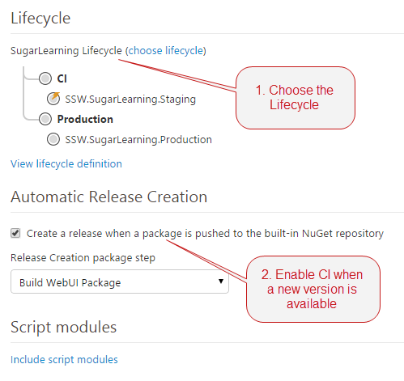

[Octopus Deploy 2.6](http://octopusdeploy.com/blog/2.6) introduced a new Lifecycles feature that makes Continuous Integration from TFS much easier. It's a must have for projects in TFS that use Octopus for deployment.

As well as allowing continuous integration, the Lifecycles feature adds some good governance around when a project can be deployed to each environment.

<!--endintro-->

Lifecycles can be found in the Library section of Octopus Deploy. By default, a project will use the Default Lifecycle which allows any deployment at any time.
<dl class="image">&lt;dt&gt;&lt;/dt&gt;<dd>Figure: Lifecycles can be found in the Library</dd></dl>
You should create a new Lifecycle for each project you've configured with Octopus Deploy. You should set up a phase to continuously deploy to your first environment (e.g. test or staging), but make sure the final phase of the lifecycle is a manual step to production.
<dl class="image">&lt;dt&gt; &lt;/dt&gt;<dd>Figure: Good Example - This lifecycle has two phases: an automatic release to a Staging server, and a manual release to the Production server.</dd></dl>
In the Process tab of your project definition, there's a panel on the right-hand side that lets you configure the Lifecycle to use. You should also enable Automatic Release Creation. If you have a CI build which publishes a new package to the Octopus NuGet feed as part of your build using OctoPack, and your first Lifecycle phase is automatic, this will result in continuous deployment to your CI environment.
<dl class="goodImage">&lt;dt&gt;&lt;/dt&gt;<dd>Figure: Good Example - This combination results in Continuous Deployment to the Staging server when a new package is pushed</dd></dl>
