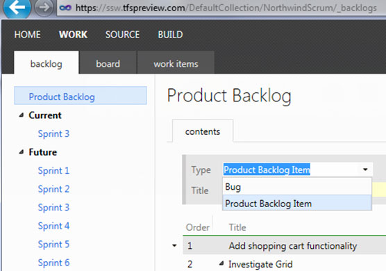
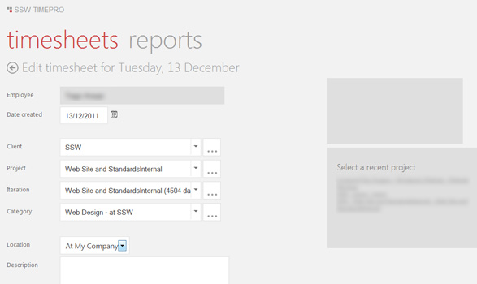

Metro is Microsoft’s UI design guideline.

<!--endintro-->

From           [Adam Cogan's blog](http://www.adamcogan.com/2012/11/18/microsoft-is-onto-something-here/) (http://www.adamcogan.com/2012/11/18/microsoft-is-onto-something-here/):

"We now have devices from phones, tablets, work PCs and servers all with the same Metro (don't tell me to call it Modern UI please) tiled user interface.
 What that means for users is that they have the same \*one\* user experience.
 What that means for developers is that we have the simplest way to build apps that go across these 3 devices."
<dl class="goodImage">&lt;dt&gt; &lt;/dt&gt;<dd>Figure: Good example – TFSPreview.com adopts the Metro style</dd></dl><dl class="goodImage">&lt;dt&gt; 
       &lt;/dt&gt;<dd>Figure: Good example – SSW TIMEPRO has been Metro influenced</dd></dl>
