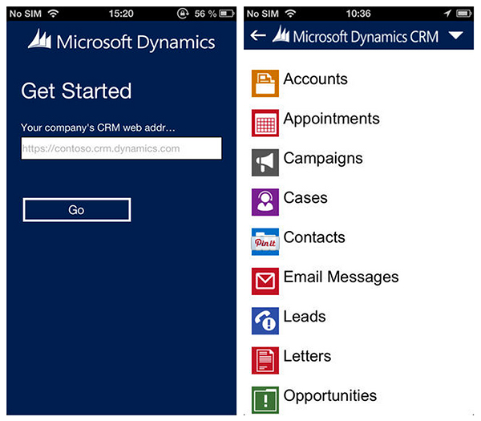

While there is a web app available, Microsoft have now released a CRM mobile app for Apple, Android and, of course, their own phone OS. It is only for CRM Online and CRM2013 On-Premise.

<!--endintro-->
<dl class="goodImage">&lt;dt&gt;&lt;/dt&gt;<dd>Figure: CRM 2013 on your mobile gives you even more accessibility to your important company information</dd></dl>
You can download it now for your device (Aussie links):

* Windows Phone:     http://www.windowsphone.com/en-au/store/app/dynamics-crm/bdf6ad14-8ff3-4db1-a9d5-336c50ef13ee
* Android:     https://play.google.com/store/apps/details?id=com.microsoft.crm.crmhost
* Apple iOS:     https://itunes.apple.com/us/app/microsoft-dynamics-crm-for/id723891307?mt=8

Make sure when you download that you're getting the official app released by Microsoft Corporation.
