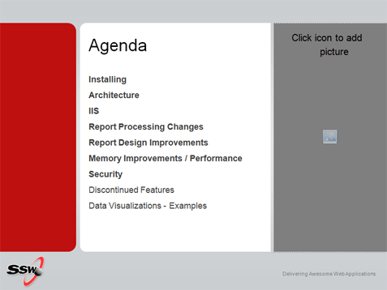
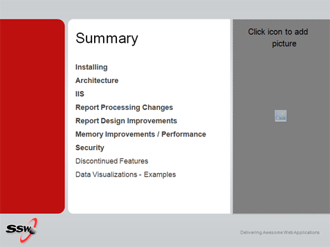

 A PowerPoint presentation is a verbal essay and it follows a structure. Shown at the start of the presentation, the Agenda slide sets expectation. 
 

  
At the end the Summary slide should be identical, and summarize what you just spoke about.

<dl>
    <dt> </dt>
    <dd class="ms-rteCustom-FigureNormal">Figure&#58; Slide for agenda </dd>
</dl>
<dl>
    <dt> </dt>
    <dd class="ms-rteCustom-FigureNormal">Figure&#58; Slide for summary (is the same as agenda) </dd>
</dl>

