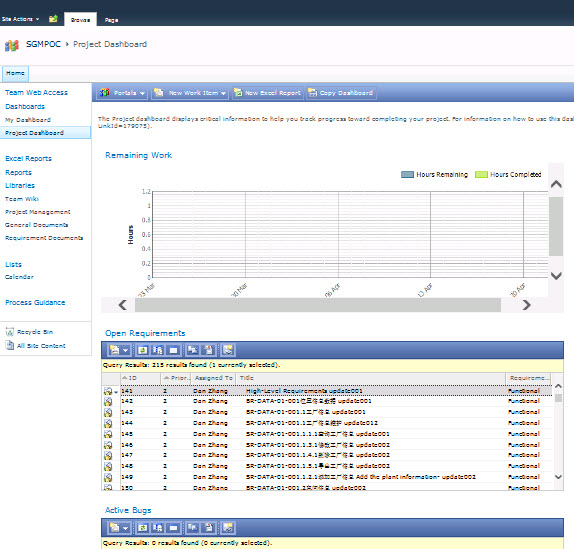

You should use the SharePoint portal in VSTS2012 because it provides you dashboards to monitor your projects as well as quick access to a lot of reports. You are able to create and edit work items via the portal as well. 

<!--endintro-->

 **Figure: SharePoint portal in VSTS 2012**
