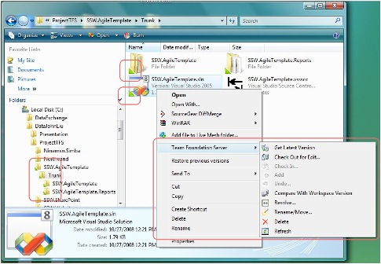

1. Install the TFS Power Tools
2. When you install this, make sure you do a 'Custom Install', and select the 'Shell Integration' option (this is off by default)

<dl>&lt;dt&gt;&lt;/dt&gt;
<dd>Figure: Using Windows Explorer for your source control is a dream (great for designers too - who don't want to use VS.NET) </dd></dl>
Suggestion to the TFS Team: I didn't see blame annotate in the drop down - which is a bit odd.

More reading from the prolific Brian Harry: 
http://blogs.msdn.com/bharry/archive/2008/11/08/oct-08-tfs-power-tools-are-available.aspx 
 
http://blogs.msdn.com/bharry/archive/2008/10/01/preview-of-the-next-tfs-power-tools-release.aspx 

<!--endintro-->
