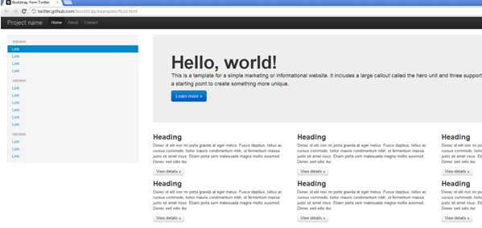
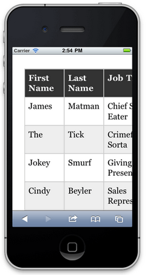
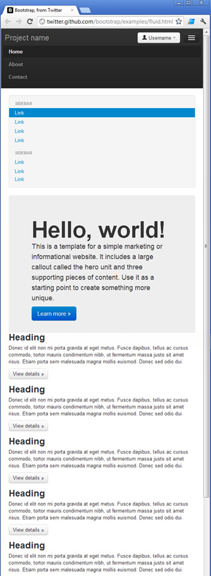

Efficient programmers do not re-invent the wheel. That's why we [use the best Web UI libraries](/_layouts/15/FIXUPREDIRECT.ASPX?WebId=3dfc0e07-e23a-4cbb-aac2-e778b71166a2&TermSetId=07da3ddf-0924-4cd2-a6d4-a4809ae20160&TermId=5af9a4e4-31fc-405a-942e-401e74ea347a).

Twitter Bootstrap is a NuGet Package that provides a jump-start for HTML based projects. It includes the HTML, CSS and JavaScript framework used by Twitter, to build the Twitter site.

<!--endintro-->

Building your site on top of bootstrap makes it much easier to have your website look great on devices of all sizes, across many different browsers.
<dl class="image">&lt;dt&gt;&lt;/dt&gt;<dd>Figure: This website template, along with many others is available as a starting point for building Bootstrap-based sites</dd></dl><dl class="badImage">&lt;dt&gt;&lt;/dt&gt;<dd>Figure: Bad example - Many websites built by using tables for positioning would render poorly on smaller devices, and be hard to use</dd></dl><dl class="goodImage">&lt;dt&gt;&lt;/dt&gt;<dd>Figure: Good example - Twitter Bootstrap uses many techniques to help make your site look great on different browsers, on all devices</dd></dl>
Read our [Rules to Better UI (Bootstrap)](/_layouts/15/FIXUPREDIRECT.ASPX?WebId=3dfc0e07-e23a-4cbb-aac2-e778b71166a2&TermSetId=07da3ddf-0924-4cd2-a6d4-a4809ae20160&TermId=2661a344-b3dc-4a77-805a-6ae72a75c90c).

### Documentation

[Bootstrap, from Twitter](https://github.com/twbs/bootstrap)

### Tailwind

Alternatively, [TailwindCSS](https://tailwindcss.com/) is also acceptable. The difference between the Tailwind and Bootstrap is a matter of how comfortable you are with CSS.

Out of the box, Tailwind is lightweight and will get the job done simply; you can build a website without ever having to look at CSS.

Bootstrap requires theme customization, but it’s more robust and solid once done. [Read more about these differences](https://themesberg.com/blog/design/tailwind-css-vs-bootstrap).
