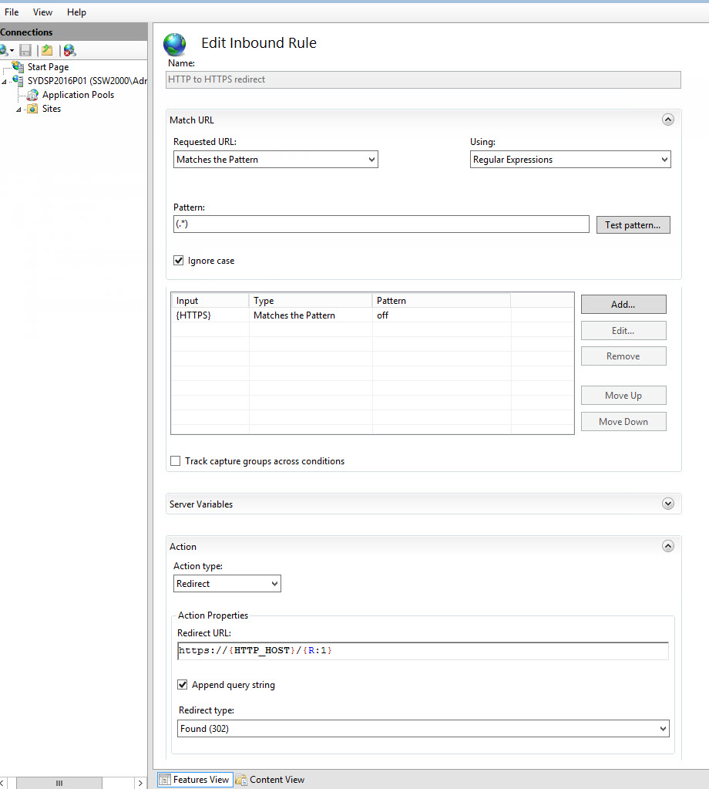

Using IIS URL Rewrite Module, Web administrators can easily set up rules to define URL rewriting behavior based on HTTP headers, HTTP response or request headers, IIS server variables, and programmatic rules. HTTP to HTTPS redirect helps boost your Google site ranking as well as adding enforcing SSL security.

<!--endintro-->

First you must download the IIS URL Rewrite module from Web Platform Component Installer. Ensure that a valid SSL Certificate is installed in IIS Server. 

1. Open URL Rewrite and begin with Add Rule(s) | Blank rule (Inbound rules)

2. Name the rule "HTTP to HTTPS redirect"

3. Add Pattern `(.\*)`

4. Add Conditions

  - Condition input:  `{HTTPS}`
  - Pattern: `off`

5. Add Action

  - Action type: `Redirect`
  - Action Properties: `https://{HTTP\_HOST}/{R:1}`
  - Redirect type: `Found (302)`

6. Apply | Back to Rules

