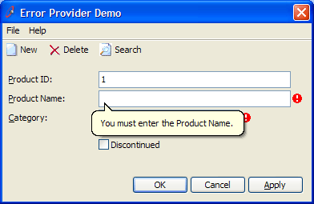

Validation is extremely important on a data entry form. There are two ways to do validation:

<!--endintro-->

1. **ErrorProvider** control  
   The **ErrorProvider** control is code intensive. You must manually handle the **Validating** event of each control you want to validate, in addition to manually running the validation methods when the OK or Apply button is clicked.      

```vb
Private Sub productNameTextBox_Validating(ByVal sender As Object, _
   ByVal e As System.ComponentModel.CancelEventArgs) Handles _
   productNameTextBox.Validating

   ValidateProductName(False)

End Sub

Private Function ValidateProductName(ByVal force As Boolean) _
   As Boolean

   If Me.productNameTextBox.Text.Length = 0 Then
      Me.errorProvider.SetError(Me.productNameTextBox,
         "You must enter the Product Name.")

      If force Then
         MessageBox.Show("You must enter the Product Name.", _
            Me.Text, MessageBoxButtons.OK, MessageBoxIcon.Warning)
      End If

      Return False
   Else
      Me.errorProvider.SetError(Me.productNameTextBox, _
         String.Empty)
      Return True
   End If

End Function

Private Function ValidateInput() As Boolean

   Dim force As Boolean = True
   Dim isValid As Boolean = ValidateProductID(force)

   If Not isValid Then
      force = False
   End If

   isValid = ValidateProductName(force)

   If Not isValid Then
      force = False
   End If

   isValid = ValidateCategory(force)

   Return isValid

End Function

Private Sub okButton_Click(ByVal sender As Object, _
   ByVal e As System.EventArgs)

   If Me.ValidateInput() Then
      'Test
   End If

End Sub
```

::: bad
Figure: Bad example - lots of code but no balloon tooltips
:::

```vb
Private Sub productNameTextBox_Validating(ByVal sender As Object, _
   ByVal e As System.ComponentModel.CancelEventArgs) _
   Handles productNameTextBox.Validating

   ValidateProductName(False)

End Sub

Private Function ValidateProductName(ByVal force As Boolean) _
   As Boolean

   If Me.productNameTextBox.Text.Length = 0 Then
      Me.errorProvider.SetError(Me.productNameTextBox, _
         "You must enter the Product Name.")

      If force Then
         If Me.balloonToolTip.IsSupported Then
            Me.balloonToolTip.SetToolTip(Me.productNameTextBox, _
               "You must enter the Product Name.")
         Else
            MessageBox.Show("You must enter the Product Name.", _
               Me.Text, MessageBoxButtons.OK,
               MessageBoxIcon.Warning)
         End If
      End If

      Return False
   Else
      Me.errorProvider.SetError(Me.productNameTextBox, _
         String.Empty)
      Return True
   End If

End Function

Private Function ValidateInput() As Boolean

   Dim force As Boolean = True
   Dim isValid As Boolean = ValidateProductID(force)

   If Not isValid Then
      force = False
   End If

   isValid = ValidateProductName(force)

   If Not isValid Then
      force = False
   End If

   isValid = ValidateCategory(force)

   Return isValid

End Function

Private Sub okButton_Click(ByVal sender As Object, _
   ByVal e As System.EventArgs)

   If Me.ValidateInput() Then
      'Test
   End If

End Sub
```

::: good
Figure: Good example - lots of code but balloon tooltips are used
:::

**Note:** The component for balloon tooltips can be found in the SSW .NET Toolkit.

The error provider has the advantage over the extended provider that it can be used with balloon tooltips. If you are not using balloon tooltips, however, the error provider should not be used.



2. **SSW Extended Provider**The SSW Extended Provider integrates with the **ErrorProvider** control to provide the same functionality, but requires no code to implement (everything can be done in the Designer).  
  
  

We have a program called [SSW .NET Toolkit](https://ssw.com.au/ssw/NETToolkit/) that implements this cool Error Provider Control
