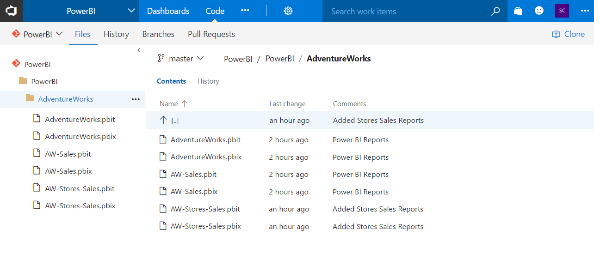

- Describe Power BI Desktop Projects
- Power BI integrates with Git repos in Azure DevOps
  * Create a workspace
  * Connect with a branch in a Git repo in Azure DevOps
  * Upload pbix file
  * Commit files to repo in Power BI Service
  * Sync files to local repo using VS Code
- Proposal
  * Create a Dev Workspace in Power BI Service
  * Connect
  * Upload any pbix files to it
  * 

<!--endintro-->

::: bad  
  
:::