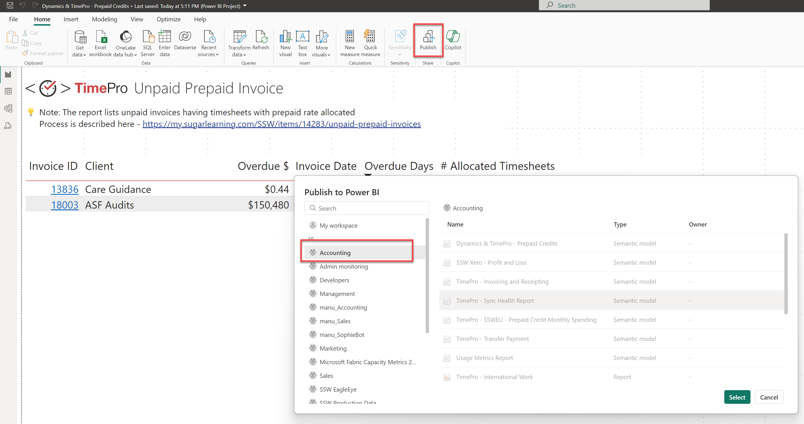
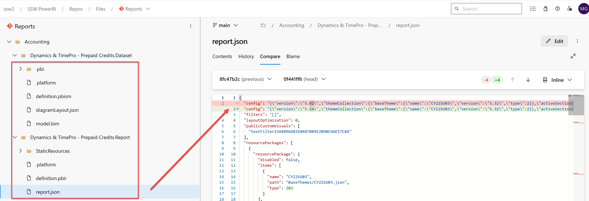
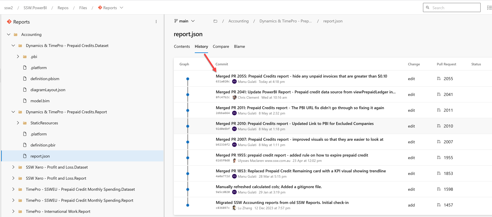
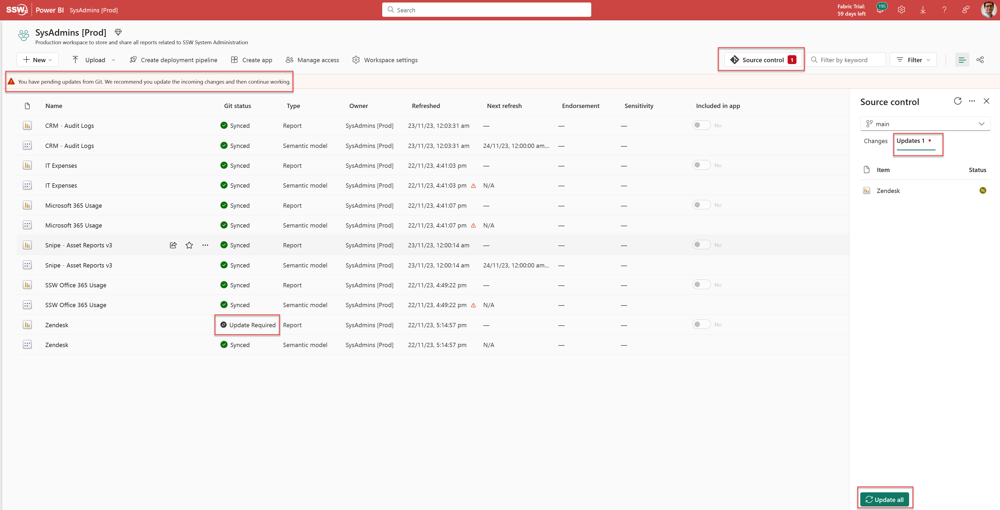

Power BI reports are generally published directly into Power BI Service. But doing so has many drawbacks. For example, you:

* Can't see what was changed
* Can't see who made the change
* Can't see when the change was made

In other words, the history of the changes isn't recorded anywhere. 

<!--endintro-->

::: bad

:::

The correct method is to 1) convert your reports to the **Power BI Desktop Projects (PBIP)** format, and check the files into version control, and 2) use Power BI's Git integration to deploy reports. When a report is saved in the PBIP format, Power BI decomposes it into multiple text files. This allows version control to identify the parts of the report that were changed. Additionally, Power BI saves the data associated with the report separately in a file called cache.abf. This file should not be saved in version control. 

::: good

:::

::: good

:::

Read the rule [Do you know the Power BI version control features?](https://www.ssw.com.au/rules/do-you-know-powerbi-version-control-features/) to learn more about Power BI Desktop Projects, and Power BI's integration with Git. 

### Editing and Committing Reports

You should no longer edit or publish reports directly in the production workspace on Power BI Service. A better process for editing and committing reports is described below. 

### Business Users

If you're a business user, watch the following video to get a walkthrough of the process you would follow to edit and commit reports. 

`youtube: https://www.youtube.com/watch?v=dlOK6QBEyQo`
**Video: Power BI Source Control for the Business User**

The entire process is done on Power BI Service (web) (except the step to create a pull request). At a high-level the steps are:

1. Create a private workspace corresponding to the workspace where your report resides (1 time)
2. Connect the private workspace to repo (1 time)
3. Create new feature branch off ‘main’ (every time)
4. Setup dataset connections (1 time) (take help from SysAdmins or Power BI Admins)
5. Edit the report in Power BI Service (every time)
6. Commit report to feature branch (every time)
7. Create PR (pull request) to merge feature branch into ‘main’ on Azure DevOps (every time)
8. Next time, create new feature branch on same workspace

If you want to update the report's data model or want more sophisticated editing features, you will need to edit the report in Power BI Desktop instead. The next section explains how you can do so. 

### Developers

If you're a developer, watch the following video to get a walkthrough of the process you would follow to edit and commit reports. 

`youtube: https://www.youtube.com/watch?v=MpedXah-Hv0`
**Video: Power BI Source Control for Developers**

The process is done on one's PC. You will need to download Power BI Desktop. At a high-level the steps are:

1. Setup a local repository on your PC
2. Create new feature branch off ‘origin/main’
3. Open Power BI Desktop, and enable Power BI Projects - File | Option Settings | Options | Preview features | Power BI project (.pbip) save option
4. Open the [definition.pbir](https://learn.microsoft.com/en-us/power-bi/developer/projects/projects-report#definitionpbir) file in the “\<Report Name\>.Reports” folder on the local repo on your PC. This will open the report in Power BI Desktop. It will allow you to edit both the report and the dataset.

   **Note:** PBIP folders do not by default contain any underlying data. So when you open a definition.pbir file the visuals may show as empty. Please refresh the report to download the data.  

5. Edit report in Power BI Desktop
6. Commit report to feature branch
7. Create PR to merge feature branch into ‘origin/main’ on Azure DevOps
8. If you are creating a new report in Power BI Desktop, please save the report as a **.pbip** report (and not .pbix). You can do so via File | Save as | Select .pbip as the file type

### Deploying Reports

Deployments would typically be done by Power BI Admins. You as a dev generally won't do this directly unless you're responsible for a workspace yourself. 

Reports can be deployed to a production workspace on Power BI Service by simply syncing the workspace with the 'main' branch in the Reports repository. The figure below illustrates this. 

   
