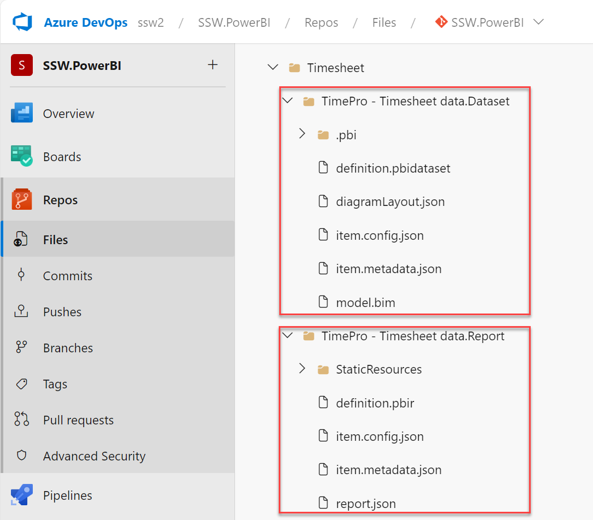
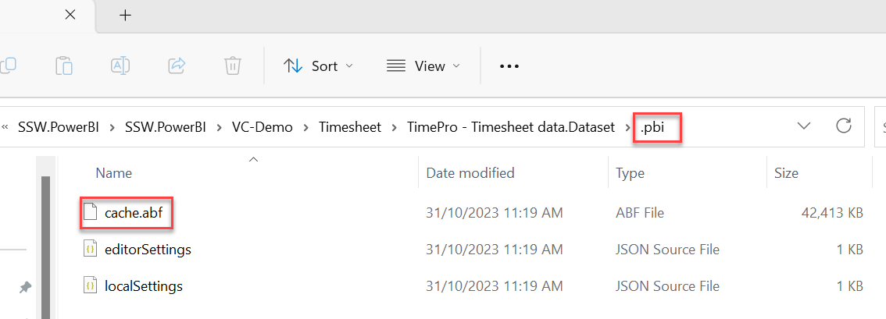
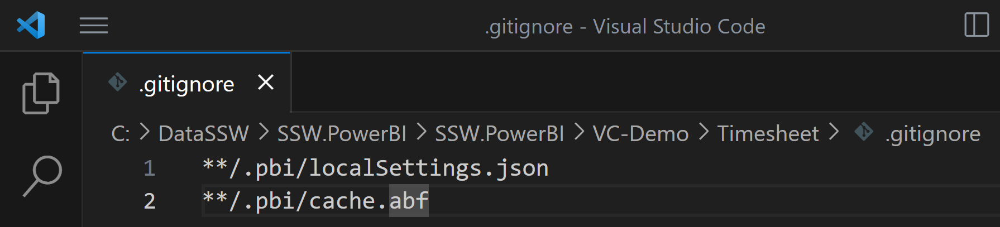

Doing version control with Power BI reports used to be problematic. The primary way of doing this was to commit the pbix file into the repository using source control tools such as Visual Studio Code (VS Code). However, this has some drawbacks: 

* Data itself gets saved to source control, which is bad as it could be large 
* Unable to see what has changed
* Version control process is not user friendly for non-developers

Microsoft has addressed these issues through the introduction of:

* [Git integration in Power BI Service via Microsoft Fabric](https://learn.microsoft.com/en-us/fabric/cicd/git-integration/intro-to-git-integration)
  * *Requires either Fabric capacity or a Power BI Premium per User license*
  * *Currently only integrates with Git repos in Azure DevOps*
* [Power BI Desktop projects](https://learn.microsoft.com/en-us/power-bi/developer/projects/projects-overview)

The following video from Microsoft Build 2023 provides an overview of this. 
`youtube: https://www.youtube.com/watch?v=OdkS7DF7ElY`
**Video: Empower every BI professional to do more with Microsoft Fabric | OD06 (Watch from min 5:00 to 13:00)**

At a high-level you can set up version control as follows. Click on the links to get more detailed instructions on Microsoft Learn. 

1. [Connect a workspace in Power BI Service with a branch in a Git repo in Azure DevOps](https://learn.microsoft.com/en-us/fabric/cicd/git-integration/git-get-started?tabs=commit-to-git#connect-a-workspace-to-an-azure-repo)
2. [Commit changes to repo through the Power BI Service](https://learn.microsoft.com/en-us/fabric/cicd/git-integration/git-get-started?tabs=commit-to-git#commit-changes-to-git)
3. [Update the workspace from Git](https://learn.microsoft.com/en-us/fabric/cicd/git-integration/git-get-started?tabs=commit-to-git#update-workspace-from-git)

Committing a report to the repo in this manner saves it as a Power BI Desktop Project (PBIP). A Project no longer contains a pbix file. It instead decomposes the report into the following artifacts.  

* [A Dataset folder](https://learn.microsoft.com/en-us/power-bi/developer/projects/projects-dataset), which contains files and folders representing a Power BI dataset
* [A Reports folder](https://learn.microsoft.com/en-us/power-bi/developer/projects/projects-report), which contains the report settings, metadata for custom visuals, etc.

::: img-medium

:::

You now have two options to edit the report and commit changes. 
1. You can directly edit the report in Power BI Service, and then commit to the repo via Power BI Service as explained [here](https://learn.microsoft.com/en-us/fabric/cicd/git-integration/git-get-started?tabs=commit-to-git#commit-changes-to-git). This is the option that non-developers may prefer as they generally don't modify the data model. Further, the version control user interface is nice and simple. 
2. Clone a local copy of the repo on your PC by using version control tools such as VS Code, and use Power BI Desktop to edit the report. 
   * The PBIP Reports folder contains a file called [definition.pbir](https://learn.microsoft.com/en-us/power-bi/developer/projects/projects-report#definitionpbir), which is what you would open to edit the report in Power BI Desktop. This allows you to edit both the report and the dataset. You may have to first enable PBIP in Power BI Desktop by going to File | Options and settings | Options | Preview features, select the checkbox for Power BI Project (.pbip) save option.
   * You would then use VS Code to commit any changes back into the repo. This is no different than committing conventional source code. Since PBIP decomposes a pbix into component files, many of which are textual, you can compare files across commits. 
   * **Note:** PBIP folders do not by default contain any underlying data. So when you open a definition.pbir file the visuals may show as empty. Once you refresh the report Power BI Desktop will download a copy of the data into a file called [cache.abf](https://learn.microsoft.com/en-us/power-bi/developer/projects/projects-dataset#pbicacheabf) which gets stored in a ".pbi" folder inside the Dataset folder. This file should not be saved in version control. You can create a .gitignore file to prevent Git from committing it to the repository.

::: img-large

:::

::: img-large

:::
