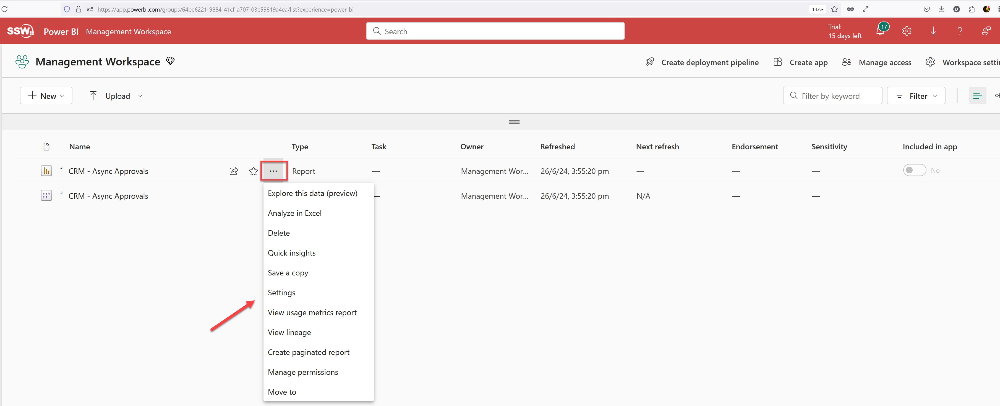
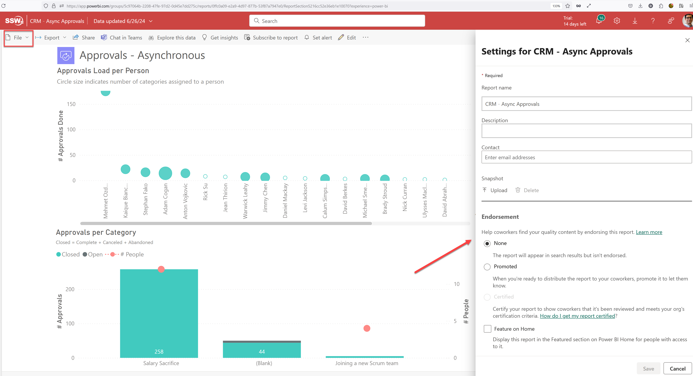

Power BI reports are generally published directly into the Power BI Service. But doing so has many drawbacks. For example, you **can't** see:

- What was changed
- Who made the change
- When the change was made

In other words, the history of the changes isn't recorded anywhere.

<!--endintro-->

::: bad

:::

::: bad

:::

::: bad

:::

The correct method is the **PBIP method**, which is: 

1. Convert your reports to the **Power BI Desktop Projects (PBIP)** format, and check the files into version control
2. Use Power BI's Git integration to deploy reports
   * Requires either Fabric capacity or a Power BI Premium per User license
   * Currently only integrates with Git repos in Azure DevOps

Read the rule on [Power BI version control features](/do-you-know-powerbi-version-control-features) to get a background on this. Note: This does not work for Power BI dashboards. Dashboards do not have a PBIP or PBIX file associated and are only available on Power BI service, and so cannot have any source control or version history.

When a report is saved in the PBIP format, Power BI decomposes it into multiple text files. This allows version control to identify the parts of the report that were changed. Additionally, Power BI saves the data associated with the report separately in a file called cache.abf. This file should not be saved in version control.

::: good

:::

::: good

:::

Historically report developers have used the .pbix or the .pbit format. These are **no longer recommended** as the new PBIP format overcomes the shortcomings of these 2 formats. 

### Editing and Committing Reports
### Business Users (Use Power BI Service)

If you're a business user, watch the following video to get a walkthrough of the process you would follow to edit and commit reports.

`youtube: https://www.youtube.com/watch?v=dlOK6QBEyQo`
**Video: Power BI Source Control for the Business User (timebox 8 min)**

The entire process is done on Power BI Service (web) (except the step to create a pull request). At a high-level the steps are:

1. Create a private workspace corresponding to the workspace where your report resides (1 time)
2. Connect the private workspace to repo (1 time)
3. Create new feature branch off ‘main’ (**every time**)
4. Setup dataset connections (1 time) (lookup your password manager or take help from SysAdmins or Power BI Admins)
5. Edit the report in Power BI Service (**every time**)
6. Commit report to feature branch (**every time**)
7. Create PR (pull request) to merge feature branch into ‘main’ on Azure DevOps and get it reviewed by a Power BI Admin (**every time**)
8. Get a Power BI Admin to deploy the report (**every time**)
9. Next time, create new feature branch on same workspace

If you want to update the report's data model or want more sophisticated editing features, you will need to edit the report in Power BI Desktop instead. The next section explains how you can do so.

### Developers (Use Power BI Desktop)

If you're a developer, watch the following video to get a walkthrough of the process you would follow to edit and commit reports.

`youtube: https://www.youtube.com/watch?v=MpedXah-Hv0`
**Video: Power BI Source Control for Developers (timebox 5 min)**

The process is done on one's PC. You will need to download Power BI Desktop. At a high-level the steps are:

1. Setup a local repository on your PC (1 time)
2. Create new feature branch off ‘origin/main’ (**every time**)
3. Open Power BI Desktop, and enable Power BI Projects - File | Option Settings | Options | Preview features | Power BI project (.pbip) save option (1 time)
4. Open the [definition.pbir](https://learn.microsoft.com/en-us/power-bi/developer/projects/projects-report#definitionpbir) file in the `<Report Name>.Reports` folder on the local repo on your PC. This will open the report in Power BI Desktop. It will allow you to edit both the report and the dataset. (**every time**)

   **Note:** PBIP folders do not by default contain any underlying data. So when you open a definition.pbir file the visuals may show as empty. Please refresh the report to download the data.

5. Setup dataset connections for that report (1 time) (lookup your password manager or take help from SysAdmins or Power BI Admins)
6. Edit report in Power BI Desktop (**every time**)
7. Commit report to feature branch (**every time**)
8. Create PR to merge feature branch into ‘origin/main’ on Azure DevOps and get it reviewed by a Power BI Admin (**every time**)
9. Get a Power BI Admin to deploy the report (**every time**)
10. If you are creating a new report in Power BI Desktop, please save the report as a **.pbip** report (and not .pbix). You can do so via File | Save as | Select .pbip as the file type

### Power BI Admins - Deploying Reports (Use Power BI Service)

Deployments would typically be done by Power BI Admins. You as a dev generally won't do this directly unless you're responsible for a workspace yourself.

Reports can be deployed to a production workspace on Power BI Service by simply syncing the workspace with the 'main' branch in the Reports repository.

