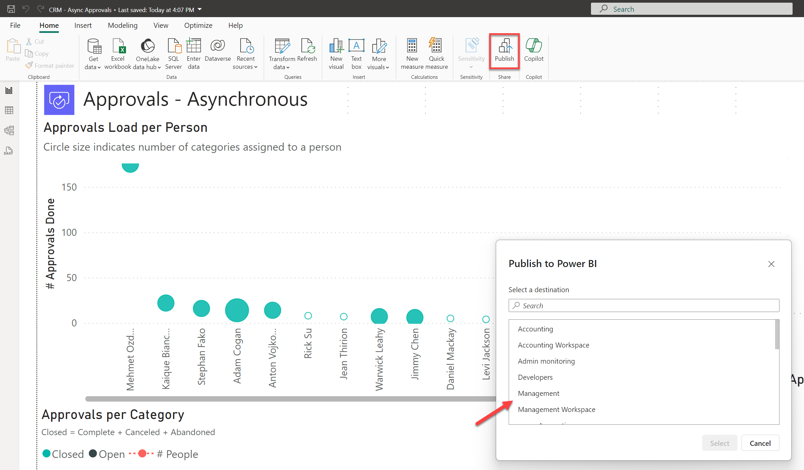
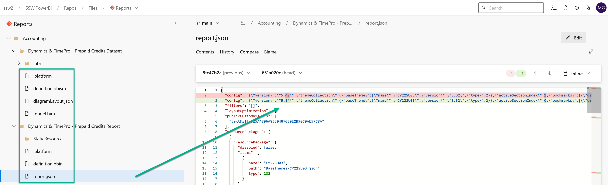

Power BI reports are generally published directly into Power BI Service. But doing so has many drawbacks. For example, you:
* Can't see what was changed
* Can't see who made the change
* Can't see when the change was made

In other words, the history of the changes isn't recorded anywhere. 

::: bad

:::

The correct method is to convert your reports to the Power BI Desktop Projects (PBIP) format, and check the files into version control. When a report is saved in the PBIP format, Power BI decomposes it into multiple text files. This allows version control to identify the parts of the report that were changed. Additionally, Power BI saves the data associated with the report separately in a file called cache.abf. This file should not be saved in version control. 

::: good

:::

::: good

:::

The rest of this document describes this process in more detail. Additionally, it describes a way that you can setup version control in your company that will allow both developers and **business users** to commit reports into version control easily. 

<!--endintro-->

## Power BI Version Control Features
In Microsoft Build 2023, Microsoft introduced the following features that make it much easier to do version control for Power BI reports:

* [Power BI Desktop projects (PBIP)](https://learn.microsoft.com/en-us/power-bi/developer/projects/projects-overview)
* [Git integration in Power BI Service via Microsoft Fabric](https://learn.microsoft.com/en-us/fabric/cicd/git-integration/intro-to-git-integration)
  * Requires either Fabric capacity or a Power BI Premium per User license
  * Currently only integrates with Git repos in Azure DevOps

The following video provides an overview of this. 

`youtube: https://www.youtube.com/watch?v=OdkS7DF7ElY`
**Video: Empower every BI professional to do more with Microsoft Fabric | OD06 (Watch from min 5:00 to 13:00)**

At a high-level you can set up version control as follows. Click on the links to get more detailed instructions on Microsoft Learn. 

1. Convert all your Power BI reports to the PBIP format
   * First enable Power BI Projects in Power BI Desktop - File | Option Settings | Options | Preview features | Power BI project (.pbip) save option
   * Second "Save As" all your .pbix files as .pbip

     ::: img-medium
     
     :::

     ::: img-medium
     
     :::

     ::: info
     Whenever you see a .pbix file it should be converted to the PBIP format.
     :::
     
   * Converting reports to the PBIP format decomposes it into the following artifacts.
     * [A Dataset folder](https://learn.microsoft.com/en-us/power-bi/developer/projects/projects-dataset), which contains files and folders representing a Power BI dataset
     * [A Reports folder](https://learn.microsoft.com/en-us/power-bi/developer/projects/projects-report), which contains the report settings, metadata for custom visuals, etc.
     
     ::: img-medium
     
     :::
     
3. Commit the PBIP artifacts into a Git repository in an Azure DevOps project. Note, as of this writing Power BI's Git integration only works with Azure DevOps. 

   **Note:** Once you convert the report Power BI Desktop will save a copy of the data into a file called [cache.abf](https://learn.microsoft.com/en-us/power-bi/developer/projects/projects-dataset#pbicacheabf) which gets stored in a ".pbi" folder inside the Dataset folder. This file should not be saved in version control. You can create a .gitignore file to prevent Git from committing it to the repository.

   ::: img-large
   
   :::

   ::: img-large
   
   :::

4.  [Connect a workspace in Power BI Service with a branch in the Git repo in Azure DevOps](https://learn.microsoft.com/en-us/fabric/cicd/git-integration/git-get-started?tabs=commit-to-git#connect-a-workspace-to-an-azure-repo)

## Developing Reports

You should no longer edit or publish reports directly in the production workspace on Power BI Service. A better process for editing and committing reports is described below. 

### Business Users

If you're a business user, watch [this video "Power BI Source Control for the Business User"](https://www.youtube.com/watch?v=dlOK6QBEyQo) to get a walkthrough of the process you would follow to edit and commit reports. 

The entire process is done on Power BI Service (web) (except the step to create a pull request). At a high-level the steps are:

1. Create a private workspace corresponding to the workspace where your report resides (1 time)
2. Connect the private workspace to repo (1 time)
3. Create new feature branch off ‘main’ (every time)
4. Setup dataset connections (1 time) (take help from SysAdmins or Power BI Admins)
5. Edit the report in Power BI Service (every time)
6. Commit report to feature branch (every time)
7. Create PR (pull request) to merge feature branch into ‘main’ on Azure DevOps (every time)
8. Next time, create new feature branch on same workspace

If you want to update the report's data model or want more sophisticated editing features, you will need to edit the report in Power BI Desktop instead. The next section explains how you can do so. 

### Developers

If you're a developer, watch [the video "Power BI Source Control for Developers"](https://www.youtube.com/watch?v=MpedXah-Hv0) to get a walkthrough of the process you would follow to edit and commit reports. 

The process is done on one's PC. You will need to download Power BI Desktop. At a high-level the steps are:

1. Setup a local repository on your PC
2. Create new feature branch off ‘origin/main’
3. Open Power BI Desktop, and enable Power BI Projects - File | Option Settings | Options | Preview features | Power BI project (.pbip) save option
4. Open the [definition.pbir](https://learn.microsoft.com/en-us/power-bi/developer/projects/projects-report#definitionpbir) file in the “\<Report Name\>.Reports” folder on the local repo on your PC. This will open the report in Power BI Desktop. It will allow you to edit both the report and the dataset.

   **Note:** PBIP folders do not by default contain any underlying data. So when you open a definition.pbir file the visuals may show as empty. Please refresh the report to download the data.  

5. Edit report in Power BI Desktop
6. Commit report to feature branch
7. Create PR to merge feature branch into ‘origin/main’ on Azure DevOps
8. If you are creating a new report in Power BI Desktop, please save the report as a **.pbip** report (and not .pbix). You can do so via File | Save as | Select .pbip as the file type

## Deploying Reports

Deployments would typically be done by Power BI Admins. You as a dev generally won't do this directly unless you're responsible for a workspace yourself. 

Reports can be deployed to a production workspace on Power BI Service by simply syncing the workspace with the 'main' branch in the Reports repository. The figure below illustrates this. 

   
