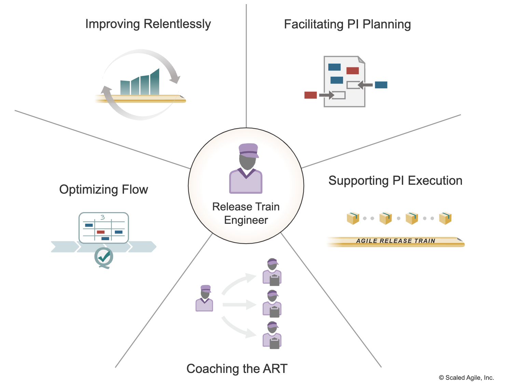

Picture this: You've got a fleet of agile teams, each buzzing with activity. Yet, despite their hard work, aligning their efforts feels like trying to synchronize an orchestra without a conductor. Deadlines slip through the cracks, and the big picture gets fuzzy. This is where a Release Train Engineer (RTE) steps in. Think of the RTE as your agile conductor, harmonizing these teams to ensure they stay in sync, hit their deadlines, and align their outputs with overarching business goals.

<!--endintro-->

## What is a Release Train Engineer (RTE)?

A Release Train Engineer (RTE) plays a pivotal role in the Agile Release Train (ART), acting as both a servant leader and a coach. In this capacity, the RTE isn't just overseeing; they're deeply involved in facilitating ART events and processes, ensuring everything runs like clockwork. Their primary mission? To assist and guide the teams within the ART, helping them navigate challenges and effectively deliver value. The RTE's role is crucial in aligning the teams' efforts with the larger organizational objectives and ensuring a smooth, consistent flow of work.

### Benefits of Utilizing an RTE

**Synchronization**

An RTE is the linchpin for maintaining synchronization across all teams on the Agile Release Train. They ensure not just routine alignment but a deep-seated harmony with the train's mission and objectives. By doing so, the RTE helps prevent the derailment of projects due to misalignment or miscommunication. It's like having an expert conductor who ensures that every part of the orchestra plays in unison, creating a symphony rather than a cacophony. This synchronization is vital for timely and cohesive deliverables, directly impacting the success of the entire train.

**Facilitation**

The RTE plays a crucial role in steering the program-level processes and execution. This isn't just about keeping meetings on track or ticking boxes on a checklist. It's about creating an environment where collaboration is seamless, decision-making is efficient, and execution is smooth. From planning sessions to retrospectives, the RTE ensures that each step in the Agile Release Train is conducted with precision and purpose. Their expertise in facilitation helps bridge gaps, iron out kinks, and keep the entire program moving forward cohesively and effectively.

**Conflict Resolution**

The RTE often steps into the role of a mediator, a crucial aspect when multiple teams are working together under tight deadlines and high stakes. In such an environment, conflicts, whether between teams or within them, are inevitable. The RTE's skill in navigating these disagreements is key. They work not just to find quick fixes, but to address underlying issues, fostering an atmosphere of understanding and collaboration. This conflict resolution capability is vital in maintaining team morale, ensuring smooth collaboration, and keeping the Agile Release Train on track towards its objectives.

::: greybox
Utilize an RTE to keep your agile teams synchronized and focused on delivering value.
:::

::: good

:::

## Why Should You Utilize an RTE?

### Improved Coordination

Utilizing an RTE introduces a pivotal element in large-scale project management: a centralized coordination hub. When you have multiple teams, each with their unique dynamics and workflows, orchestrating their efforts can be a complex task. An RTE simplifies this by serving as the single point of contact and oversight. This streamlined coordination not only makes managing the teams more straightforward but also ensures that everyone is moving in sync, following a unified strategy. The presence of an RTE thus leads to smoother operations, clearer communication, and a more cohesive approach to reaching project milestones.

::: greybox
Appoint an RTE for centralized coordination and management.
:::

### Enhanced Communication

An RTE is not just a facilitator but a vital communication nexus within the Agile Release Train. In complex projects with multiple stakeholders, messages can easily become muddled or lost in translation. The RTE actively works to prevent this. By maintaining open, clear channels of communication, they ensure that everyone, from team members to top management, is on the same page. This enhanced communication is key to avoiding misunderstandings, ensuring transparency, and fostering a collaborative environment. Ultimately, it contributes to the overall health and success of the project, keeping everyone aligned and focused on common goals.

::: greybox
Rely on an RTE for effective communication between teams and stakeholders.
:::

::: bad
Bad Example - Lack of an RTE can lead to communication gaps, causing delays and misunderstandings.
:::

## Conclusion

Employing a Release Train Engineer (RTE) is more than a strategic decision; it's a critical component for success in any scaled agile framework. An RTE does much more than just keep the wheels turning; they ensure that multiple agile teams work in harmony, like a well-oiled machine. From seamless communication and pinpoint coordination to adept conflict resolution, the RTE's role is multifaceted and indispensable. They stand as the cornerstone of any Agile Release Train, orchestrating efforts to drive efficiency, alignment, and, ultimately, success.
