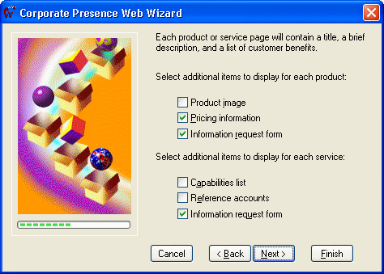
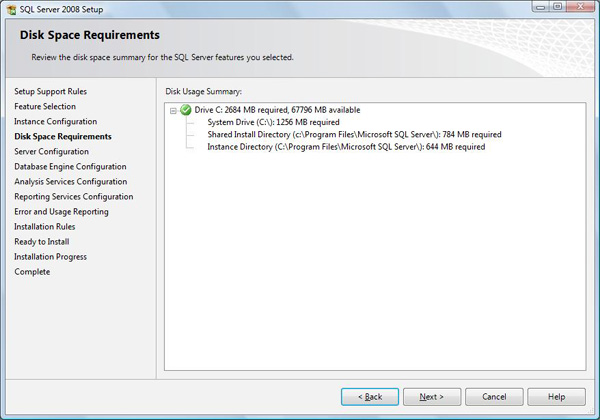

In a wizard, a visual indication about the progress should be  provided so users know where they are up to. It should also let the user  know which steps have been completed and how far to go.

A good way to do this is use a left navigation bar with  **bold** on the step they are currently at.

<!--endintro-->
<dl class="badImage">&lt;dt&gt; 
       
   &lt;/dt&gt;<dd>Figure: Bad Example - The progress bar does not indicate completed nor next steps</dd></dl><dl class="goodImage">&lt;dt&gt;
      
   &lt;/dt&gt;<dd>Figure: Good Example - This wizard form shows all steps and indicates where the user is up to</dd></dl>
