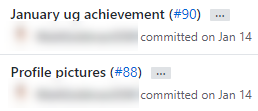

Reading ugly commits is not very pleasant and makes it very confusing when you have to check the commit history.
<dl class="badImage">&lt;dt&gt;&lt;/dt&gt;<dd>Bad Example: The commits have no meaning</dd></dl>
<!--endintro-->

`youtube: https://www.youtube.com/embed/uBLWVxnPLP4`
 
 

Ways to improve your commit log:

### Tip #1: Have a nice, concise comment

Examples:

* "Fixed bug with emoji engine"
* "Added new emoji filter"
* "Updated Architecture Diagram to have emojis"

### Tip #2: Using prefixes

Even better is to add a helpful prefix to categorize your commits.

Examples:

* "Fix: Fixed bug with emoji engine"
* "Feature: Added new emoji filter"
* "Doc: Updated Architecture Diagram to have emojis"

### Tip #3: Using emojis 💄

In a text message, emojis helps to add emotion and context to plain text. Why not use them in commit messages too 😃?

Examples:

* "🐛 Fixed emoji engine in language component"
* "🚀 Added emoji filter on Snapchat"
* "📄 Added emoji’s to changelog"

There are a bunch more options to choose from - [carloscuesta/gitmoji: An emoji guide for your commit messages. 😜 (github.com)](https://github.com/carloscuesta/gitmoji)

### Tip #4: Using gitmoji VSCode extension

h [Gitmoji - Visual Studio Marketplace (visualstudio.com)](https://marketplace.visualstudio.com/items?itemName=Vtrois.gitmoji-vscode).

You can even go 🤘 hardcore and use the  **gitmoji cli -** [carloscuesta/gitmoji-cli: A gitmoji interactive command line tool for using emojis on commits. 💻 (github.com)](https://github.com/carloscuesta/gitmoji-cli)
<dl class="goodImage">&lt;dt&gt; 
       
&lt;/dt&gt;&lt;dt&gt;   &lt;/dt&gt;<dd>Good Example: Great use of emoji and concise message</dd></dl><dl class="image">&lt;dt&gt;&lt;/dt&gt;<dd>Figure: see what emojis work best with each topic here: 
<a href="https://gitmoji.carloscuesta.me/">gitmoji.carloscuesta.me/</a></dd></dl>
