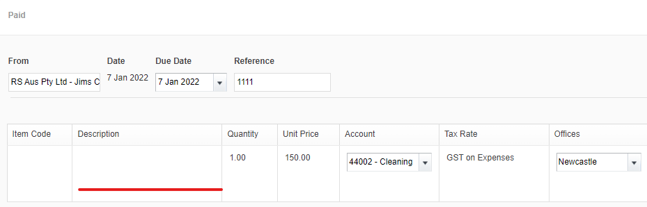
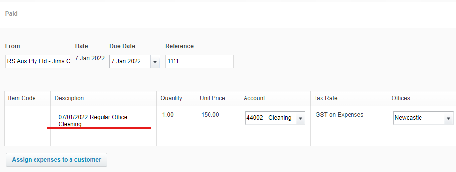

If your descriptions have meaningful comments then you don't need to go back to paperwork to investigate things.

e.g.  The period the invoice relates to.

<!--endintro-->

::: bad

:::

::: good

:::