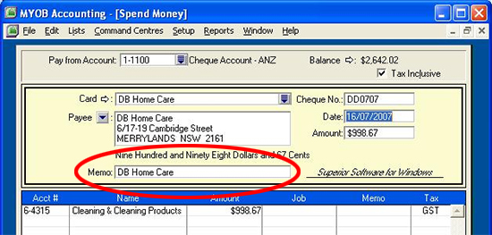
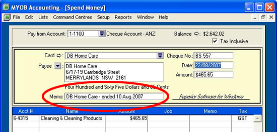

If your descriptions have good comments then you don't need to go back to paperwork to investigate things. 

e.g.  The period the invoice relates to.

 <excerpt class='endintro'></excerpt> 
<dl class="badImage"><dt>
</dt><dd>Figure: Bad Example</dd></dl><dl class="goodImage"><dt>
</dt><dd>Figure: Good Example</dd></dl>

