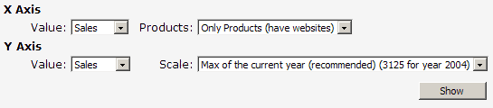
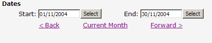
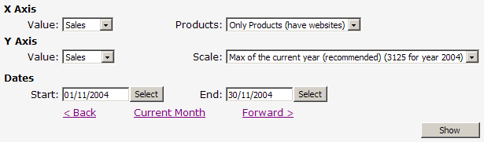

When visitors are navigating through your site and they need       to make a selection from a control with fixed values, it is       best to have the control automatically post back. This makes       navigating your site quicker as the user does not have to       click other buttons to see the changes which they have made.       It is also important to remember that controls which do not       have set values, such as text boxes, should have a "Show"       button available to click once the visitor is finished       entering their data.

<!--endintro-->
<dl class="badImage">&lt;dt&gt; 
      
   &lt;/dt&gt;<dd>Figure: Bad Example - because the combos can be set to autopostback and should not have a "Show" button.</dd></dl><dl class="goodImage">&lt;dt&gt; 
      
   &lt;/dt&gt;<dd>Figure: Good Example - because the combo boxes have fixed values and can autopostback.</dd></dl><dl class="badImage">&lt;dt&gt; 
      
   &lt;/dt&gt;<dd>Figure: Bad Example -  because the text boxes do not have fixed data and thus should have a "Show" button.</dd></dl><dl class="goodImage">&lt;dt&gt; 
      
   &lt;/dt&gt;<dd>Figure: Good Example -  because there is a "Show" button as the text boxes do not contained fixed data.</dd></dl><dl class="goodImage">&lt;dt&gt; 
      
   &lt;/dt&gt;<dd>Figure: Good Example -  because the combos can be set to autopostback while the text boxes have the "Show" button available.</dd></dl>
