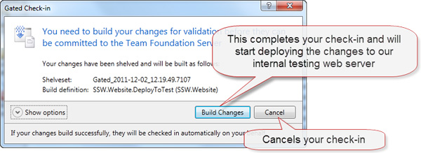
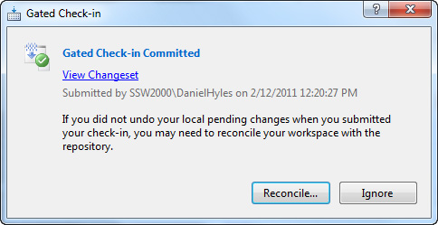
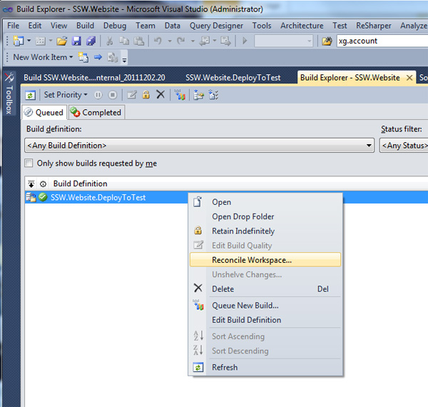
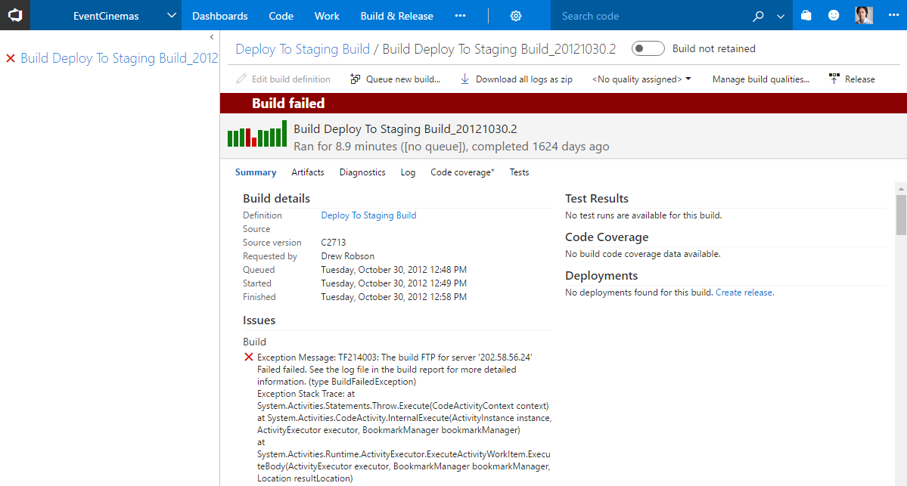

We strongly believe that this process should all be automated and painless. Even the receptionist should be able to make a grammatical change on the website and be able to deploy it.

We use TFS gated check-ins to do the deployment for us. When a developer checks there changes into TFS they are prompted with a gated check-in screen.

<!--endintro-->

The developer clicks the "Build changes" button and waits for the build to complete. This process needs to take no longer than 2 minutes as it just makes cranky developers if this takes too long.
The code is put into a TFS shelf, compiled, had all the unit tests run against the code and then deployed to the internal webserver if successful.

Once this process has completed successfully, the developer will get presented with the ability to "reconcile" their local copy of the files as they have now been successfully checked-in to TFS.

If the developer does not have Build notifications on there local computer then this step can also be easily performed via the Build Explorer in Visual Studio.

The SSW website also queues a build process that deploys the changes to our Australian staging server. A developer can then use [Octopus deploy](/rules-to-better-octopus-deploy) to push it live to our Australian and US production sites.

The process that syncs to our external servers is very quick. Only the changes in TFS since the last deployment are sent. This typically takes under 10 seconds to complete.

If the build fails then no changes would get pushed to staging and developers should [swarm to fix the build](/do-you-swarm-to-fix-the-build).

