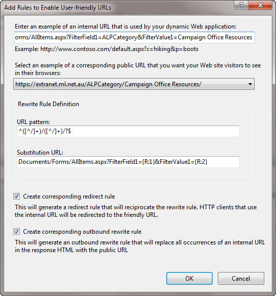

The text of a URL should make sense and relate to the content of the relevant page.                     Apart from helping with Google Juice users frequently read URL's.

There are a few options for how you format the text of a URL. The following suggestions                     are in preference order:

<!--endintro-->

1. Dashes between words:         **rules-to-better-website-layouts.aspx
** [RECOMMENDED] This option appears to be most common and        [Craig Bailey](http://www.craigbailey.net/)'s  preferred way
2. Capitalize each word (Title Case):         **RulesToBetterWebsiteLayouts.aspx**
3. Upper case for appropriate words:         **RulestoBetterWebsiteLayouts.aspx**
4. Underscores between words:         **rules\_to\_better\_website\_layouts.aspx**
5. Lower case for all words:         **rulestobetterwebsitelayouts.aspx**

### More info

You can install the IIS [URL Rewrite Module](http://learn.iis.net/page.aspx/460/using-the-url-rewrite-module/) for IIS7 you can make ugly URL's much more friendly.
<dl class="image">&lt;dt&gt;
                        &lt;/dt&gt;<dd>Figure: Rewrite both the HTML in the page and the incoming URL's to be friendly </dd></dl>
The caveat here is that it will only work if the URL is in the clear on the page.

**Note:** This could only be done with certain links as others are postbacks as well.
