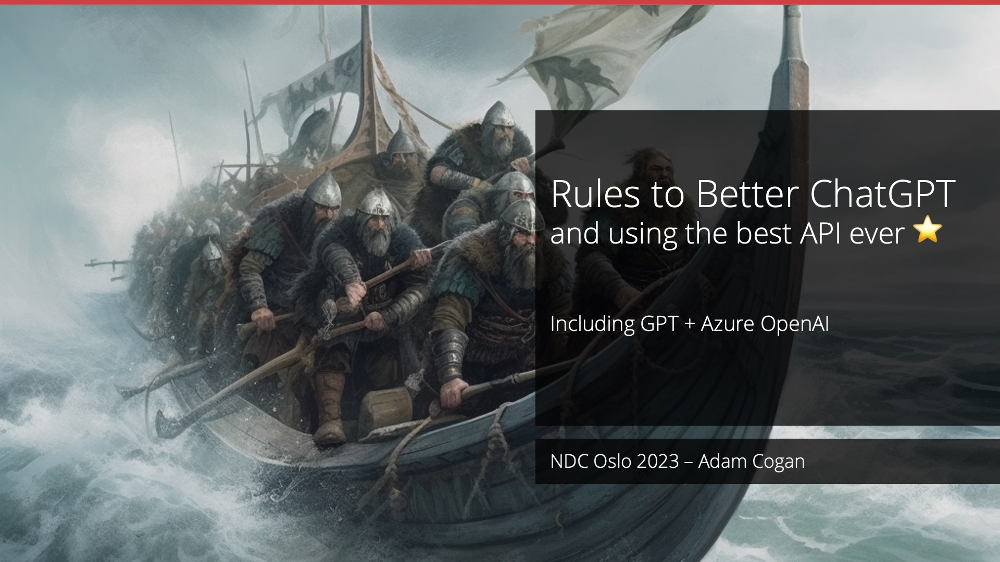
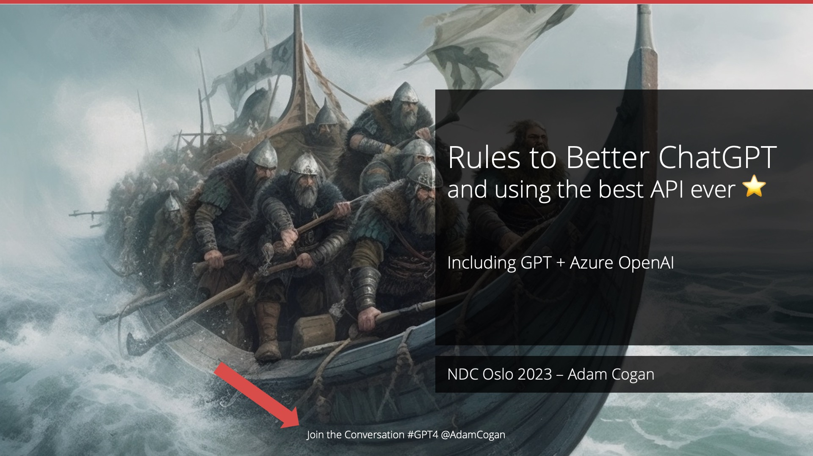

In the digital age, the challenge lies in fostering engaging and meaningful online discussions after presentations. As presentations increasingly move to virtual platforms, it becomes crucial to create an interactive environment that encourages active participation and knowledge exchange.

Getting attendees at a course or presentation to be online involved has many benefits:

* They can share ideas with the presenter and each other
* They can provide feedback for improvement of the material
* They can share key points that they learn

<!--endintro-->

Using hashtags is an effective way to promote and encourage discussion around presentations in the online realm. By incorporating relevant and unique hashtags into presentation materials and social media posts, participants can easily identify and join the conversation. Hashtags create a sense of community, allowing individuals to connect, share insights, and engage in discussions beyond the boundaries of the presentation itself. 

They serve as a powerful tool to aggregate conversations, making it simpler for participants to find and contribute to ongoing discussions related to the presentation topic. Embracing hashtags as a promotional strategy can enhance the reach, visibility, and overall engagement of presentation discussions in the online space.

::: bad

:::

::: good

:::