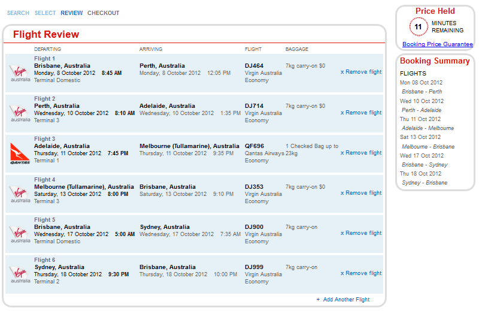

Headings that direct the user around your web page are       important as it gives the user the feeling of confident in       using your web page. The user will tend to feel lost and       unsure in what he/she should be doing next, if a website       dose not directs them properly. Good navigation through       directing headings removes this feeling and gives the user       confidence. This rule becomes especially important when it comes to shopping applications, of which Amazon is exemplary. A great shopping application includes the following breadcrumbs:

* Showing the user where they are up to in buying products, previous steps and the next step in the process, gives the user the confidence that they are doing the right steps in purchasing a product.
* Allowing the user to go back to previous steps allows them to change or review a previous choice.
* Showing the user where they are up to and what is next shows the user what is left in the process in purchasing a product.

<!--endintro-->

**SSW Example:**

* Product Basket - Add/Remove products in your shopping Basket
* Shipping Details - Enter where you would like products shipped
* Payment Details - Select how you pay and enter details
* Confirmation of Purchase - Display information about their purchase

<dl class="image">&lt;dt&gt; 
      
   &lt;/dt&gt;<dd>Figure: Simple Header that tells the user where they have come from</dd></dl>
**Amazon Example:**

* Welcome Icon - Ordering from Amazon.com is quick and easy
* Address Icon - Choose a shipping address
* Ship Icon - Choose your shipping options
* Pay Icon - Select a payment method

The following heading from Amazon shows the user at what stage of the ordering process they are at and what they can expect next. This covers the whole billing process.
<dl class="image">&lt;dt&gt; 
      
   &lt;/dt&gt;<dd>Figure: This is how headings should look</dd></dl><dl class="image">&lt;dt&gt; 
      
   &lt;/dt&gt;<dd>Figure: Virgin Australia uses a more subtle approach  </dd></dl>
