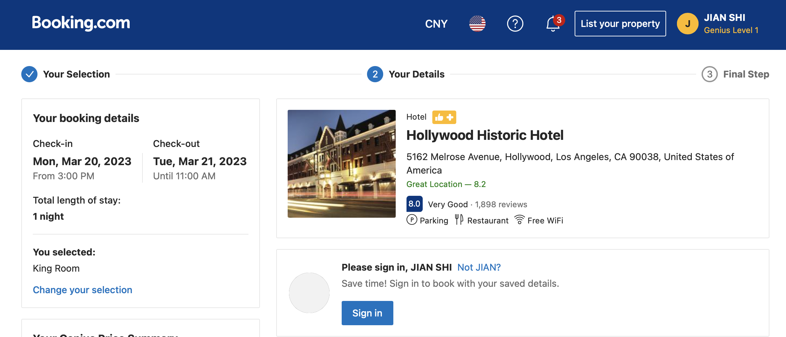
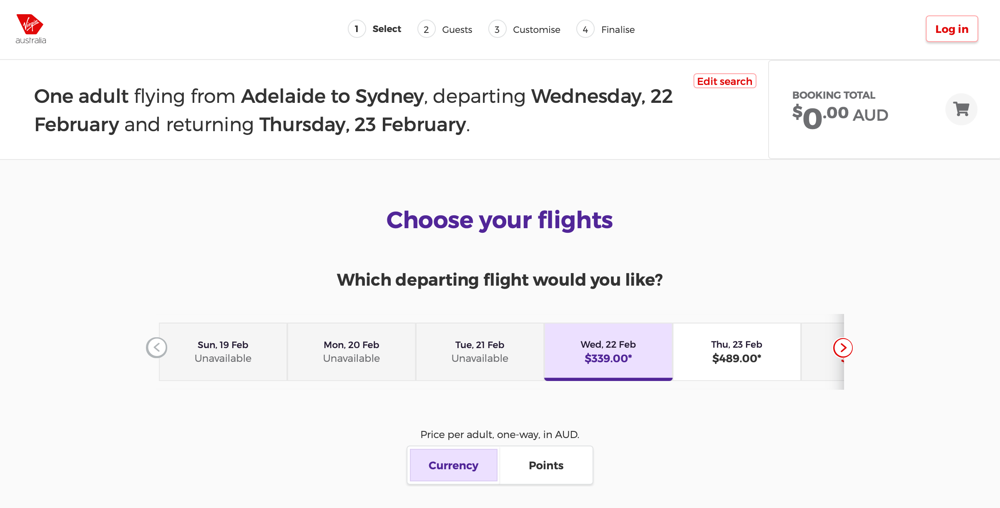

Breadcrumb that guide the user through your website are important as they give the user a sense of confidence in using your application. The user will tend to feel lost and unsure of what to do next if a application does not guide them properly. Good navigation through directional headings removes this feeling and gives the user confidence. This rule is especially important when it comes to design an shopping-cart checking out or software setting up wizard. 

A great wizard should includes a 'Wizard Breadcrumb' with the following elements:

* Showing the user where they are up to, previous steps and the next step in the process, it gives the user the confidence that they are doing the right steps.
* Showing the user what is left in the process, it gives the user an idea of how long the process will take.
* Allowing the user to go back to previous steps allows them to change or review a previous choice.

<!--endintro-->

 **SugarLearning's example:**

* Clear and Intuitive Interface - The wizard have an interface that is easy to understand and use, with clear instructions and user-friendly design.
* Step by step guidance - Guide users through the process of setting up a new company with clear, concise instructions that are easy to follow.

::: good

:::

::: good

:::

::: good

:::