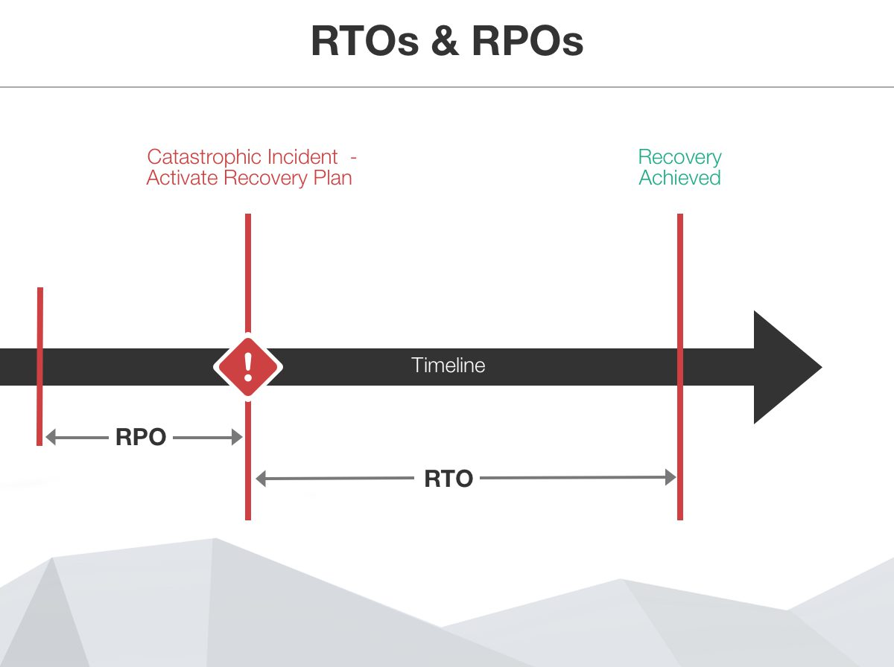

At some time or another all businesses will experience a catastrophic incident.  At these times it is important to track the disaster, analyse the downtime and learn from the experience.

To do this it is important that you already have a few objectives established and you measure the actual results.  The objectives you would establish are RPO (Recovery Point Objective) and RTO (Recovery Time Objective) and the measurements that you take at the time of a disaster are RPA (Recovery Point Actual) and RTA (Recovery Time Actual).

It is important to practice your disaster recovery at least every 12 months so that you can be certain that you are investing in the minimum amount of resources that you require and so that you can be certain that your plan works.        

<!--endintro-->

**So what do these terms mean?**

**Figure: RTO's vs RPO's**

**RPO**

RPO or Recovery Point Objective, is a measure of the maximum tolerable amount of data that the business can afford to lose during a disaster. It also helps you measure how long it can take between the last data backup and a disaster without seriously damaging your business. RPO is useful for determining how often to perform data backups.

**RTO**

RTO or Recovery Time Objective, is a measure of the amount of time after a disaster in which business operation is retaken, or resources are again available for use.  This measurement determines the amount of resources that are required for the recovery to happen within the timeframe required.

**RPA** 

RPA or Recovery Point Actual, is the actual measurement of the amount of data lost during a disaster recovery.

**RTA**

RTA or Recovery Time Actual, is the actual measurement of downtime during a disaster recovery.

It is important to note that these may all be different for different services.  For example at a bank you may have a transaction database, this may need to be only ever able to experience a RPA\RTA of a few minutes as even in that few minutes, thousands of transactions could be lost.  However the same bank may have a website that they are happy to have an RTA\RPA of several hours as this is much less critical to the banks overall operation.

**How to calculate these values?**

RTO and RPO is determined via consultation called a business impact analysis (BIA).  The organisation needs to work out what the maximum amount of data that they are prepared to lose and also the maximum amount of time that they are prepared to be without services.  These are both measured in time, and could be seconds, minutes, hours or days depending on the organisation's requirements.  This is a balancing act as generally the shorter the timeframe required, the more resources the organisation will need in order to achieve the target.  

After this a disaster should be simulated to test that the RTA/RPA values match the RTO/RPO required by the organisation.

For example recently Mr Bob Northwind experienced a catastrophic incident.  The failure occurred at 8pm local time on a Friday night.  His website and also his sales transaction software were affected.

In his Disaster Recovery Plan he had the following objectives:

| Service       |    RPO        |   RTO |
| ------------- | -----------   | ----- |
| Northwind Website     | 2 days        | 4 hours |
| North Sales   | 4 hours       | 8 hours |

After the recovery was complete they then analysed the downtime which showed the following:

| Service            |    RPA        |   RTA  |
| ------------------ | -----------   | ------ |
| Northwind Website  | 8 hours       | 2 days |
| North Sales        | 8 hours       | 8 hours|

When they analysed the data they discovered a few issues with their Disaster Recovery Plan.  

1.  They didn't have any spare hardware on premises which meant that to get the website back up and running they needed to find a shop on a weekend to buy a server and then start the recovery process.  This delayed them by an entire day.
2.  Mr Northwind's IT Manager had mistakenly set the backups to only taking 12 hourly backups at midnight and midday each day.  This meant that the most recent backup for both services had occurred at 12pm on Friday and they had 8 hours of missing transactions when the greatest allowable data loss should have only been 4 hours.

::::info
This is why it is important to practice your disaster recovery plan.  A real incident is not the ideal time to realise that your backup/procedures are inadequate.