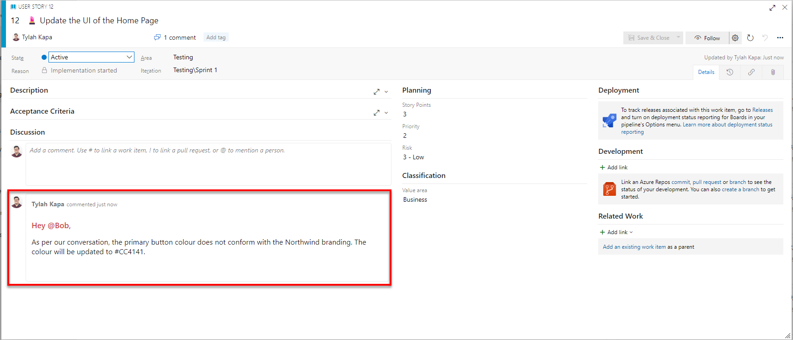
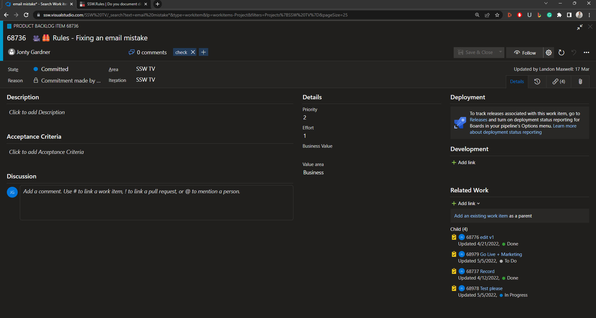
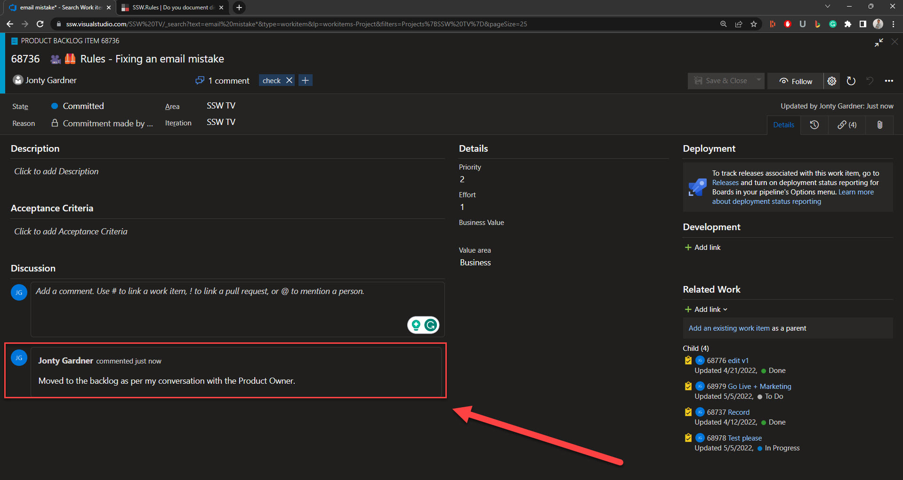

Work items often have a great description and Acceptance Criteria. However, work can change quickly; sometimes, the justification for those changes ends up in emails or instant messages.

If decisions and discoveries aren't in a central location, it can cause significant pain down the line. For example, if a new developer starts working on a work item, they might get halfway through the task only to find out their work has been wasted due to side conversations in emails. Therefore, when the requirements of a Work Item change or critical information is found, these details should be accessible to everyone on the Scrum team.

That's why the discussion section of a work item rocks!

<!--endintro-->

`youtube: 2Ff6NQrWMsY`
**Video: Documenting decisions and discoveries with [Piers Sinclair](https://ssw.com.au/people/piers-sinclair) (3 min)**

### What should be documented?

All important discoveries and decisions made around a Work Item should be recorded. If you think another Scrum team member would find the recorded information useful or you will need to recall it in the future, then document it.

Some examples include:

**Discoveries**  

* A developer finds a blocking issue hindering the Work Item's progress  
* A developer has investigated Application Insights, they can't see any errors, and they don't think there is a problem with the HTTP calls. So, Application Insights is no longer a priority for investigation
* A tester notices a problem with a feature

**Decisions**  

* The Product Owner has asked for changes to the functionality
* A developer gets approval to implement a new UI design
* A tester has tested and approved the feature in staging

#### What about project-wide changes?

If you're documenting something that **affects the project at a high level**, make sure to create an artifact for that in your [project documentation](/awesome-documentation) and then link to it in the PBI as well.

### When should changes be documented?

Ideally, you want to update an item as soon as a critical decision or discovery has been made. However, updating the Work Item at the following stages is particularly important.

* Before a call
* Before a Sprint Review
* After a significant event
* Before switching focus
* Before going home

Keeping Work Items as up-to-date as possible ensures that the information is recorded while fresh in your mind, isn't forgotten about and has a strong audit trail. It also keeps the people invested in the Work Item informed of progress.

### How do you document changes?

Now, you might be wondering about the best approach for recording a change. 

Noting it down seems like a good idea, but the problem with that approach is that it quickly gets lost or forgotten about and isn't recorded in a regularly checked place. 

Sending an email is an okay approach, but the information will quickly be lost, buried under hundreds of other emails, unseen by anyone who might need to see it later on. Additionally, the audit trail is poor since there is no consistent thread. 

The best method is for developers to **update the discussion thread of the Work Item** they're working on. Then, if an email is really needed, send a link to the Work Item.

Using the Work Item discussion provides several benefits to developers on the team, including: 

::: good
Providing one source of truth
:::

::: good
Work Item hand-off doesn't need to be an involved process
:::

::: good
Providing a history of the Work Item
:::

::: good
Easily accessible by anyone in the team
:::

::: good
Provides proof of approval
:::  

::: bad

:::

::: email-template
|          |     |
| -------- | --- |
| To:      | Product Owner|
| Cc:      | Development Team|
| Subject: | Project - Work Item Update |
::: email-content  

### Hi Bob,

As per our conversation, the primary button colour does not conform with the Northwind branding. The colour will be updated to #CC4141.
:::
:::

::: bad
Figure: Bad example - Sending an email to confirm updates to the work item
:::  

::: good

:::

::: bad

:::

::: good 

:::
