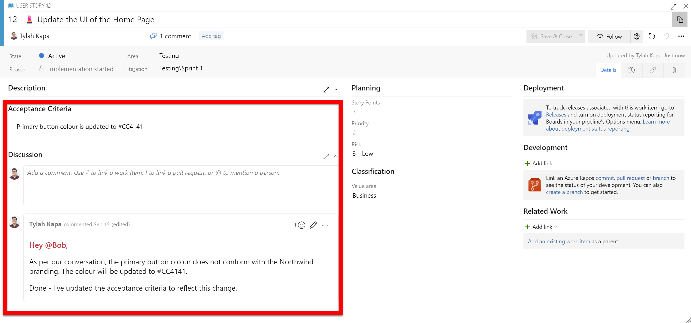

Work can change quickly. So, if decisions and discoveries haven't been documented, it can cause significant pain down the line. For example, if a new developer takes over the Work Item, they might be confused or uninformed. Therefore, when the requirements of a Work Item change or critical information is found, these details should be accessible to everyone on the Scrum team. 

<!--endintro-->

### What should be documented?

All important discoveries and decisions made around a Work Item should be recorded. Generally, if you think another developer would need to know this information or get value from it, then document it.

Some examples include:

* Discovery - The developer finds a blocking issue hindering the Work Item's progress  
* Discovery - The developer has investigated Application Insights, they can't see any errors, and they don't think there is a problem with the HTTP calls. So, Application Insights is no longer a priority for investigation
* Decision - The Product Owner has asked for changes to the functionality
* Decision - The developer gets approval to implement a new UI design

### When should changes be documented?

Ideally, you want to update an item as soon as a critical decision or discovery has been made. However, updating the Work Item at these stages is particularly important.

* Before calling someone to show the Work Item
* Before switching focus onto another Work Item or project
* Before a Sprint Review
* If you have made a particularly significant discovery
* Any time where you might need to relay the information found
* Before you go home for the day.

Keeping Work Items as up-to-date as possible ensures that the information is recorded while fresh in your mind, isn't forgotten about and has a strong audit trail. It also keeps the people invested in the Work Item informed of progress.

### How do you document changes?

Now, you might be wondering about the best approach for recording a change. 

Noting it down seems like a good idea, but the problem with that approach is that it quickly gets lost or forgotten about and isn't recorded in a regularly checked place. 

Sending an email is an okay approach, but the information will quickly be lost, buried under hundreds of other emails, unseen by anyone who might need to see it later on. Additionally, the audit trail is poor since there is no consistent thread. 

The best method is for developers to **update the Work Item** they're working on. Then, if an email is really needed, send a link to the Work Item.

Using the Work Item discussion provides several benefits to developers on the team, including: 

::: good  
Providing one source of truth  
:::  
::: good  
Work Item hand-off doesn't need to be an involved process  
:::   
::: good  
Providing a history of the Work Item  
:::  
::: good  
Easily accessible by anyone in the team   
:::   
::: good  
Provides proof of approval  
:::  

::: bad
  
:::

::: email-template
|          |     |
| -------- | --- |
| To:      | Product Owner|
| Cc:      | Development Team|
| Subject: | Project - Work Item Update |
::: email-content  

### Hi Bob,

As per our conversation, the primary button colour does not conform with the Northwind branding. The colour will be updated to #CC4141.
:::
:::

::: ok
Figure: Okay Example - Sending an email to confirm updates to the Work Item.
:::  

::: good  
  
:::   
