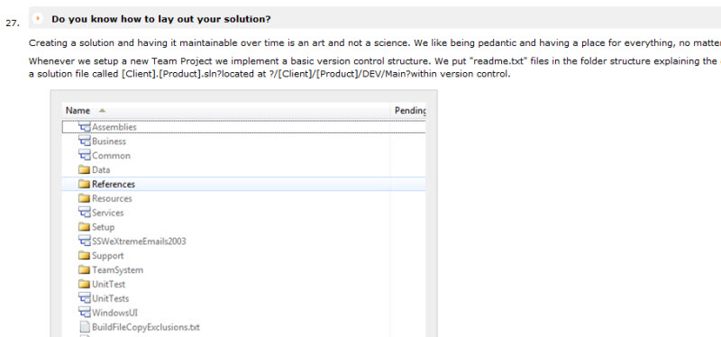

If you find yourself developing a decision process to make a choice, that process should be [documented as a standard](/document-the-job). If want to explain further how you did something to solve a specific problem, you should record that in a blog post.

Any time you find yourself writing a long email, ask yourself whether it should be recorded in rule or a blog post, rather than just in an email. This way everyone who might find it useful can see it, not just the people on the email thread.

<!--endintro-->

::: img-medium 

:::

### Does it make a rule?

If you go the extra mile, you will end up with one or more rules based on any scenario where a decision has been made.

For example, you're speaking to software architects and clients about option A or B... you usually put the Pros and Cons in an "As per our conversation" email. This email is a potential rule that may help others. Even if you don't have the time to make that content generic enough to be a rule, just send a copy of the email to the Rules webmaster asking for a new rule. 

Then the next time, the email to clients will need just a link to that rule.

### Care for SEO 

Always link the blog post to the rule(s) and vice versa. For example, you could add something like this to your post: _"This blog post is consistent with the good example on the rule {{ Rule URL }}}"._ It's awesome for Search Engine Optimization.
