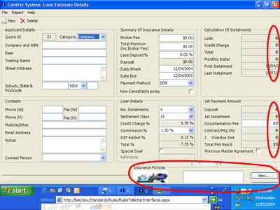
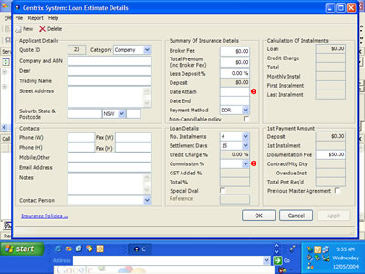
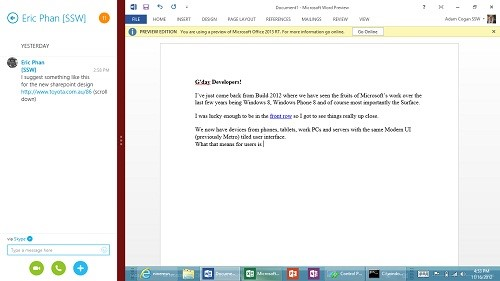

One side effect of having busy forms is that it doesn't scale down.

<!--endintro-->

Each user prefers to have their own resolution. You must check if your controls will fit on the user's screen. Think about on which computers your application will run, and what devices will display it. To be on the safe side, it is advisable to fit your controls on a 1024 x 768px screen. Our projector has that resolution and it may well be used for presenting your application to the client.
<dl class="badImage">&lt;dt&gt;&lt;/dt&gt;
<dd>Figure: Bad Example - Form is too large to fit inside 1024x768px resolution</dd></dl><dl class="goodImage">&lt;dt&gt;&lt;/dt&gt;
<dd>Figure: Good Example - Form fits inside any screen resolution</dd></dl>
The potential solutions for this problem are:

1. Reorder and move the controls around on the form.
2. Implement Tab pages.
3. Use a wizard type interface, with Next, Back and Finish.
4. Create multiple forms each containing a subset of the controls.
5. Create a menu based form where the items are categories that some form controls fall under.
Similar to VS. Net's Tools -> Options.
6. Hide unimportant controls and add the option to show them if necessary

Read our rule on[Do you design your web pages to work on 1024x768px (not 800x600px)?](http://www.ssw.com.au/ssw/Standards/Rules/RulesToBetterWebsitesLayout.aspx#Responsive)

From [Adam Cogan](http://www.adamcogan.com/2012/11/18/microsoft-is-onto-something-here/)  (http://www.adamcogan.com/2012/11/18/microsoft-is-onto-something-here/ ):

I am amazed how good the split screen is so you can be reading email while continuing to watch that movie.
 One thing developers need to be aware of when building apps, is to consider the size for the different resolutions in particular when an application is snapped. On the Surface, the snap view divides the screen up into ¼ and ¾, but this will be different on different devices (actually the snap view is always 342 pixels) so you really need to get into responsive designing. For a good user experience, keep the left snap view for reading, not interactive stuff like filling in forms.
 The great thing for developers is the way you test. With Visual Studio 2012, the emulator simulates the Surface perfectly.
<dl class="ssw15-rteElement-ImageArea"></dl>

::: good
Figure: The Surface screen allows you to place two apps side by side.

:::
