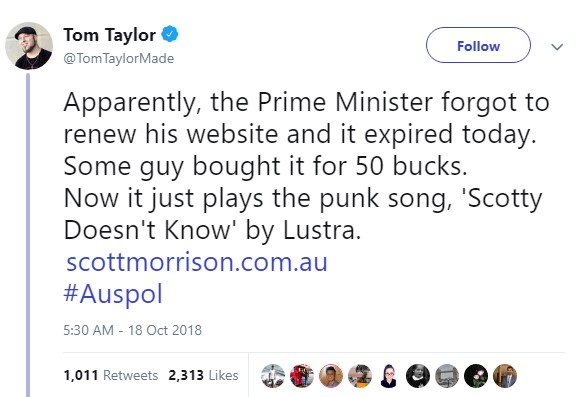

This is not one of the main ones, but still relevant. Your domain name is important!

Here are a few things 

* Using exact match: Using keywords that closely match your product or service in your domain name can be beneficial for SEO and user understanding. However, it's essential to strike a balance between relevance and the natural flow of the domain name. Example: if you search for the word car, it’s more likely that the first search result will have “car” on it.
* Seniority of your website: Older domains may have more authority and trust with search engines. Newer domains can still perform well but may need more time to establish authority.
* Avoiding dashes: Avoiding hyphens in your domain name is generally a good practice because it can make the domain easier to remember and type. Additionally, domains without hyphens often appear cleaner and more professional.
* Auto-renewal: Setting your domain to auto-renew is a smart practice to ensure you don't accidentally lose control of your domain due to expiration. Don’t be like Australian PM Scott Morrison [who lost control of his domain name](https://www.sbs.com.au/news/pm-s-website-taken-over-by-troll-plays-loop-of-scotty-doesn-t-know) to a prankster.

<!--endintro-->

::: bad
Figure: Bad example - What happens when you lose your domain to a prankster and you are the PM.

:::

::: good
Figure: Good Example - This website has its main product 'car' in its domain.

:::