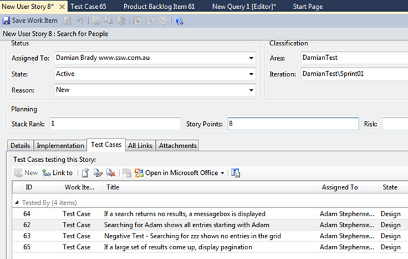
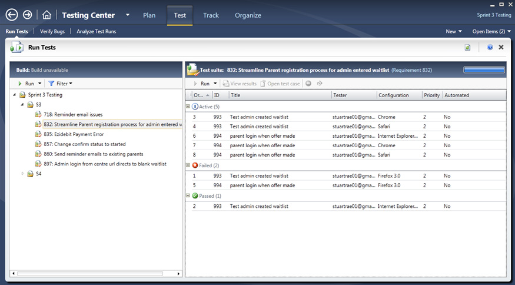
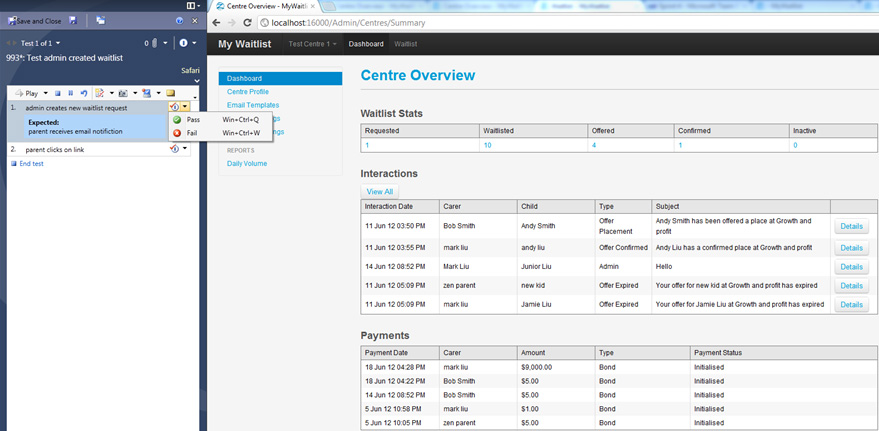

**Acceptance Tests** check that the Acceptance Criteria on a story are met. 

Test cases that define these acceptance tests should be written during story development and managed in the same system as the code, e.g. Azure DevOps. This allows for easier traceability between the code and the tests related to that code.

A combination of human and automated tests is likely to be required to complete the acceptance tests for a story.

<!--endintro-->

The goal is for teams to move beyond manual testing and implement automated testing. E.g. CodedUI tests, Telerik Tests etc

They are typically built by the developers.

Test cases answer the question, "How do I test and what are the test steps?"

::: greybox
 Positive Test - When I enter ‘Adam’ in the Search box and click ‘Search’ I will see all entries starting with Adam in the Grid   
 Negative Test - When I enter ‘zzz’ in the Search box and click ‘Search’ I will see **no** entries in the Grid   
 Gold Plating - If no results are retuned show a message box ‘No results found’   
 Gold Plating – Validation: If no search text is entered, the ‘Search’ button should be disabled   
 Gold Plating – Validation: If the button is disable and search text is entered, the ‘Search’ button becomes enabled   
 Gold Plating – Right clicking on a column header and using the ‘Sort’ functionality, sorts the data by that column   
 Gold Plating – if a large set of results is returned, clicking the pagination page numbers shows the correct data   
 Gold Plating – if a large set of results is returned and we are on page &gt; 1, clicking the ‘Prev’ button goes to the previous page   
 Gold Plating – if a large set of results is returned and we are on page 1, ‘Prev’ button does not error   
 Gold Plating – if a large set of results is returned and we are on page &lt; MaxPage, clicking the ‘Next’ button goes to the next page   
 Gold Plating – if a large set of results is returned and we are on page = MaxPage, clicking the ‘Next’ button does not error   
:::
::: good
Figure: Good example - Acceptance Tests
:::

