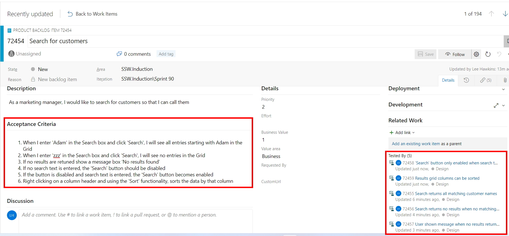

**Acceptance Tests** check that the Acceptance Criteria on a User Story are met. 

Test cases that define these acceptance tests should be written during story development and managed in the same system as the code (e.g. Azure DevOps). This allows for easier traceability between the code and the tests related to that code.

A combination of human and automated tests is likely to be required to complete the acceptance tests for a User Story.

<!--endintro-->

Suppose we have a user story to implement searching on customers with the following acceptance criteria on the User Story:

* When I enter ‘Adam’ in the Search box and click ‘Search’ I will see all entries starting with Adam in the Grid   
* When I enter ‘zzz’ in the Search box and click ‘Search’ I will see **no** entries in the Grid   
* If no results are returned show a message box ‘No results found’   
* If no search text is entered, the ‘Search’ button should be disabled   
* If the button is disabled and search text is entered, the ‘Search’ button becomes enabled   
* Right-clicking on a column header and using the ‘Sort’ functionality, sorts the data by that column

The PBI for this User Story in Azure DevOps would look like this, with the Acceptance Criteria clearly defined and the Acceptance Test cases linked to the PBI:

**Note:** The acceptance test cases need to be linked to the PBI with the link type **Tested By**.

The Acceptance Test cases can be seen in Azure Test Plans for the appropriate Sprint:

The tester then runs each Acceptance Test case:

